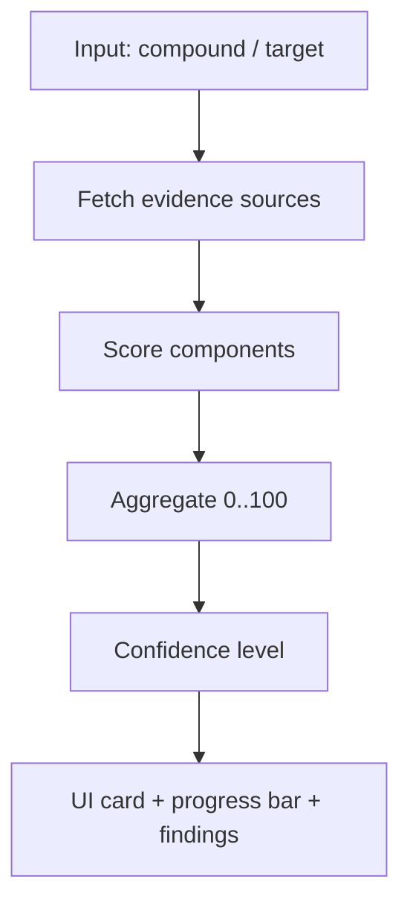

# MM Efficacy Estimation — Visual Guide

Questa pagina mostra **come** presentiamo il punteggio “MM efficacy estimation” in modo moderno (leggibile, scansionabile, con progress bar) e **come interpretarlo**.

## Terminologia (cosa stai guardando)

- **Score (0–100)**: indicatore sintetico di “evidenza” (non è una probabilità clinica).
- **Confidence level**: livello qualitativo in base a fonti/completezza dati.
- **Evidence sources**: categorie di segnali (trial, letteratura, meccanismo/target).
- **Limitations**: cosa manca (es. nessun meccanismo ChEMBL, pochi trial, ecc.).

## Pipeline (rendering/valutazione)

## Esempi (come appare in UI)

### Example 1 — High efficacy (es. bortezomib)

  <h3>Multiple Myeloma Efficacy Estimation 95 / 100</h3>
  <progress class="bmy-progress bmy-progress--good" max="100" value="95"></progress>
  
<strong>Interpretation:</strong> Strong evidence for MM efficacy

  
<strong>Confidence:</strong> High

  <ul>
    <li>Evidence sources: Clinical trials, PubMed literature, Target analysis</li>
    <li>Clinical status: FDA approved / many MM trials</li>
    <li>Key findings: strong target relevance + mechanism + trials</li>
  </ul>

### Example 2 — Medium efficacy (investigational)

  <h3>Multiple Myeloma Efficacy Estimation 58 / 100</h3>
  <progress class="bmy-progress bmy-progress--mid" max="100" value="58"></progress>
  
<strong>Interpretation:</strong> Moderate evidence for MM efficacy

  
<strong>Confidence:</strong> Medium

  <ul>
    <li>Evidence sources: Clinical trials, PubMed literature</li>
    <li>Clinical status: Phase II trials (limited MM signal)</li>
    <li>Limitations: missing or partial mechanism data</li>
  </ul>

### Example 3 — Low/no efficacy

  <h3>Multiple Myeloma Efficacy Estimation 8 / 100</h3>
  <progress class="bmy-progress bmy-progress--low" max="100" value="8"></progress>
  
<strong>Interpretation:</strong> Insufficient evidence for MM efficacy

  
<strong>Confidence:</strong> Insufficient data

  <ul>
    <li>Evidence sources: (none)</li>
    <li>Limitations: no MM trials + limited literature + missing mechanism</li>
  </ul>

## Guida interpretazione score

| Score range | Color | Interpretazione | Azione tipica |
| --- | --- | --- | --- |
| 90–100 | green | “Excellent evidence” | farmaco consolidato / alta fiducia |
| 70–89 | green | “Strong evidence” | late-stage / molte fonti |
| 50–69 | yellow | “Moderate evidence” | mid-stage / segnale parziale |
| 30–49 | blue/neutral | “Limited evidence” | esplorativo |
| 0–29 | gray | “Insufficient data” | nessuna evidenza MM |

## Note di sicurezza e limiti

!!! warning
    Questo score è un indicatore di *evidenza* (informativo). Non sostituisce:
    - linee guida cliniche
    - judgment del clinico
    - validazione regolatoria

