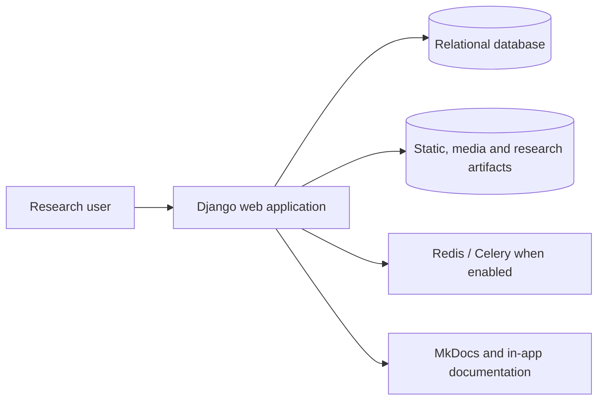
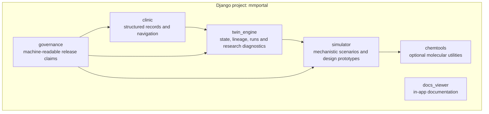
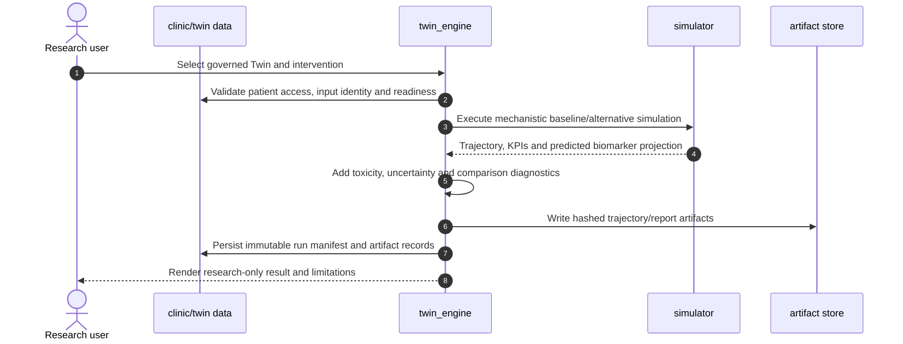
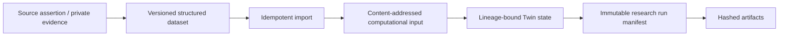

# Current system architecture

> **CURRENT architecture.** This page describes the repository at the verified SHA. It is not the target virtual-laboratory architecture.

## System context



The primary UI is server-rendered Django with incremental HTMX interactions. Development uses SQLite by default. PostgreSQL and a production-grade runtime are target M0-S concerns unless separately verified in a deployment.

## Current application containers



## Bounded responsibilities

### `clinic`

- structured patient, assessment and treatment entities;
- patient list/detail and clinical-history surfaces;
- ownership fields and selected API filtering;
- current product-authentication entry points;
- temporary governed smoke-user command.

Current limitation: object-level authorization is not yet consistently centralized across all web views and aggregate queries.

### `simulator`

- `MathematicalModel` ODE execution;
- scenario and `SimulationAttempt` workflows;
- PK/PD presets and time-resolved dose functions;
- model-relative KPI summaries;
- experimental therapy-design code.

Current limitation: core biological parameters and several endpoint definitions are heuristic research abstractions.

### `twin_engine`

- persistent `PatientTwinState` and parent/child lineage;
- computational-input identity;
- longitudinal labs, interruptions and adverse events;
- observation model and residuals;
- calibration infrastructure;
- mechanistic counterfactual runs;
- uncertainty, sensitivity, robustness and backtesting prototypes;
- immutable run manifests, artifact hashes, comparability and invalidation;
- Simple Research View, Research Cockpit and Developer Console.

Current limitation: infrastructure does not establish identifiable or externally validated patient-specific prediction.

### `chemtools`

- optional RDKit-dependent and molecular-analysis utilities;
- asynchronous jobs where configured;
- generated artifacts.

Current limitation: molecular utilities are exploratory and are not evidence of anti-myeloma efficacy.

## Current scientific run flow



## Current data and identity flow



Private source documents and direct identifiers stay outside Git. The repository stores contracts and de-identified/synthetic material only.

## Current authentication boundary

```text
public: documentation and selected simulator surfaces
protected: clinic, research, simulator-management and API surfaces
configured login target: Django admin login
normal product login/role contract: incomplete
```

The target least-privilege role architecture is tracked in M0-S issue `#8`; it is not current behavior.

## Current deployment and CI boundary

- deterministic dependency lock exists;
- several GitHub Actions workflows exist;
- image-build and deployment automation exist;
- branch-protected aggregate scientific CI is not yet verified;
- production security, PostgreSQL, storage, quotas, observability and recovery must be evidenced separately under M0-S.
