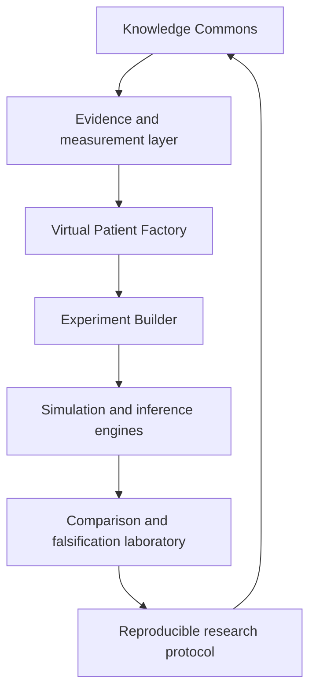

# Target virtual laboratory architecture

> **TARGET architecture.** Components in this document are not current capabilities unless explicitly mapped to [Current system architecture](CURRENT_SYSTEM.md) and the [model registry](../models/REGISTRY.md).

## Target capability map



## Target layers

### 1. Knowledge Commons

- disease biology, cell lineage, targets, pathways and mechanisms;
- current and emerging therapies;
- resistance, toxicity and measurement semantics;
- evidence levels, contradictions and valid domains;
- learning paths by professional role;
- direct links from claims to model parameters and experiments.

### 2. Evidence and measurement layer

- atomic source assertions;
- immutable datasets and data cards;
- biomarker, MRD, imaging, genomic and functional-outcome contracts;
- uncertainty, missingness and measurement-error models;
- external dataset adapters and frozen benchmark tasks.

### 3. Virtual Patient Factory

- lineage-bound patient state;
- synthetic archetypes and governed cohort generation;
- state estimation and observation models;
- calibration, identifiability and posterior/ensemble uncertainty;
- explicit healthy lineage, malignant compartments, organ and immune states as evidence permits.

### 4. Experiment Builder

- current regimens and alternative schedules;
- drug combinations and sequences;
- innovative molecules and target/modality definitions;
- CAR-T, bispecific, ADC and logic-gated hypotheses;
- comparator, endpoint, horizon and falsification definitions;
- no experiment can execute without versioned inputs and allowed-claim boundaries.

### 5. Simulation and inference engines

Candidate engines include:

- multi-drug PK/PD;
- state-space estimation;
- clonal evolution;
- competing residual-disease/reservoir hypotheses;
- marrow niche and immune recovery;
- bone and organ dynamics;
- mechanistic toxicity;
- causal protocols only when identification assumptions are explicit;
- adaptive therapy and optimal-control research.

These are target candidates, not validated current models.

### 6. Comparison and falsification laboratory

- simple and mechanistic baselines;
- rolling-origin temporal backtesting;
- sensitivity, uncertainty and identifiability diagnostics;
- robust Pareto fronts and decision stability;
- negative-result preservation;
- automatic rejection when data, evidence or compatibility gates fail.

### 7. Reproducible protocol and artifact layer

- immutable run manifest and version vector;
- source/data/model/configuration lineage;
- hashed artifacts and comparability decisions;
- model, dataset and evidence cards;
- machine-readable experiment protocol;
- export for wet-lab, retrospective or external-validation follow-up.

## Target virtual-patient state

A future multiscale state may be represented abstractly as:

$$
X_t = [B_t, R_t, C_{1:k,t}, N_t, I_t, O_t]^T
$$

where:

- $B_t$ is malignant bulk burden;
- $R_t$ is a residual/dormant compartment under a declared hypothesis;
- $C_{1:k,t}$ are subclone states;
- $N_t$ is marrow-niche state;
- $I_t$ is immune/normal-lineage state;
- $O_t$ is organ and functional state.

This is a target state contract, not a claim that every component is observable or identifiable.

### Falsification requirement

A proposed state component is rejected or deferred if it has no measurable proxy, no identifiable effect, no evidence-linked parameterization or no improvement over a simpler comparator.

## Target experiment contract

Every experiment must specify:

```text
research question
virtual patient/cohort identity
source and dataset versions
model versions
intervention and comparator
endpoints and units
assumptions
uncertainty model
falsification criteria
allowed and forbidden conclusions
artifact and report versions
```

## Current-to-target dependency

```text
M0-R canonical baseline
→ M1 reproducible longitudinal loop
→ M2 measurement/evidence semantics
→ M3 external benchmark
→ M4 multiscale competing models
→ M5 therapy design and control
→ M6 E2 reproducible-research release
```

A target capability cannot bypass the evidence and validation layers merely because it is technically implementable.
