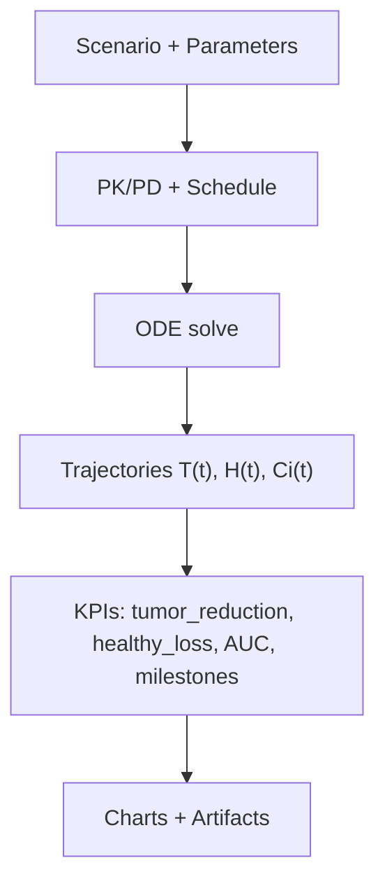

# Simulator Guide - Complete Explanation

## 🎯 What Does the Simulator Do?

The simulator is like a **virtual laboratory** where you can test Multiple Myeloma treatments without risks. It's like playing a video game, but based on real science!

### Who is it for?

- ✅ **Physicians** who want to test therapeutic strategies
- ✅ **Researchers** studying new drug combinations
- ✅ **Students** learning oncology
- ✅ **Anyone** wanting to understand how treatments work

### What can you do?

1. **Simulate** → See how a virtual patient responds to drugs
2. **Optimize** → Find the perfect dose for maximum benefit/minimum harm
3. **Compare** → Test different combinations and choose the best
4. **Learn** → Understand the mathematical models behind treatments

---

## 📚 Basic Concepts Explained Simply

### What is Multiple Myeloma?

It's a blood cancer where certain cells (plasma cells) in the bone marrow grow too much and abnormally.

### How do the drugs work?

Anti-myeloma drugs attack tumor cells in 3 ways:

1. **Lenalidomide** → Wakes up the immune system to attack the tumor
2. **Bortezomib** → Blocks the tumor cells' "waste pumps," causing them to die
3. **Daratumumab** → Antibody that attaches to tumor cells and marks them for destruction

### What are "mathematical models"?

Imagine a **weather forecast**, but for your health:

- Weather uses equations to predict rain
- We use equations to predict how cells respond to drugs

Our equations consider:

- **Cell growth** → How fast they multiply
- **Cell death** → How many die from drugs
- **Competition** → Healthy cells vs tumor cells
- **Drugs in body** → How they're absorbed, distributed, eliminated

---

## 🧠 Under the hood: model + diagrams (Mermaid)

### Simulation pipeline (inputs → ODE → KPIs)



### Key equations (human version)

$$
\frac{dT}{dt} = r_T T \left(1-\frac{T}{K_T}\right) - \left(\sum_i E_i(C_i)\right)T
$$

$$
\frac{dC_i}{dt} = -k_{elim,i}C_i + u_i(t)
$$

Full deep dive (theory + implementation + metrics): `Guides → Mathematical Models`.

---

## 🚀 How to Use the Simulator - Step by Step

### Step 1: Choose a Scenario (Patient)

Go to **Simulator** → See the list of virtual patients.

**What do the labels mean?**

- 🟢 **Low Risk** = Early disease, easier to treat
- 🟡 **Intermediate Risk** = Moderate disease
- 🔴 **High Risk** = Advanced disease, more difficult

**For beginners:** Start with Low Risk!

### Step 2: Check Laboratory Values

When you open a scenario, you see a table with values like:

| Value | What It Means | Normal |
|-------|---------------|--------|
| **ANC** (Neutrophils) | White blood cells that defend against infections | >1.5 |
| **Platelets** | Cells that stop bleeding | >75 |
| **Creatinine Clearance** | How well kidneys work | >60 ml/min |
| **LDH** | Enzyme that increases if there's damage | <250 U/L |

🚨 **IMPORTANT:** If these values are out of range, the system **blocks** the simulation for safety!

### Step 3: Choose Drugs and Doses

#### Lenalidomide (Pill)

- **Normal dose:** 25 mg per day
- **If kidneys don't work well:** Reduce to 10-15 mg
- **How it works:** Taken every day for 3 weeks, then 1 week off

**Practical example:**
```
Normal patient: 25 mg/day
Patient with kidney problems: 10 mg/day
```

#### Bortezomib (Injection)

- **Normal dose:** 1.3 mg/m² (per square meter of body surface)
- **If neuropathy (tingling):** Reduce to 1.0 mg/m²
- **How it works:** Injected twice a week

**Practical example:**
```
Patient without problems: 1.3 mg/m²
Patient with tingling hands/feet: 1.0 mg/m²
```

#### Daratumumab (Infusion)

- **Normal dose:** 16 mg/kg (per kilogram of weight)
- **How it works:** Intravenous infusion once a week

**Practical example:**
```
Patient 70 kg: 16 × 70 = 1120 mg total
```

### Step 4: Check Safety Badges

When you enter doses, you'll see colored badges:

🟢 **Green "Safe"** → Perfect dose, go ahead!
🟡 **Yellow "Borderline"** → Dose at the limit, watch for side effects
🔴 **Red "Unsafe"** → Dose too high, system blocks you!

### Step 5: Choose Duration and Virtual Patients

**Time Horizon**

- How long to simulate the treatment
- **Recommended:** 90-180 days (3-6 months)
- **Maximum:** 365 days (1 year)

**Cohort Size**

- How many virtual patients to test together
- **Recommended:** 100 patients (more reliable results)
- **Fast:** 30 patients (for quick tests)

**Why use more patients?**
Like averaging grades at school: if you take 1 test you can get 10 or 4 by chance,
but if you take 10 tests the average tells you your true level!

### Step 6: Click "Run Simulation"

The system now:

1. ⚙️ **Calculates** how drugs enter the body (pharmacokinetics)
2. 🎯 **Simulates** effects on tumor and healthy cells (pharmacodynamics)
3. 📈 **Predicts** results over time
4. 📊 **Shows** graphs and numbers

**Wait time:** 5-30 seconds (depends on how many virtual patients)

---

## 📊 Understanding Results

### Main Graphs

#### 1. "Cells Over Time" Graph

Shows 2 lines:

- 🔴 **Red line** = Tumor cells (we want it to go down!)
- 🔵 **Blue line** = Healthy cells (we want it to stay high!)

**Good result:**

- Red goes down a lot (tumor shrinks)
- Blue drops little (few side effects)

**Bad result:**

- Red doesn't drop enough (tumor resists)
- Blue drops too much (too many side effects)

#### 2. "Drug Concentration" Graph

Shows how much drug is in the blood over time.

**What to see:**

- **High peaks** = Effective dose
- **Too low valleys** = Drug gone, tumor can regrow

### Key Numbers (KPIs)

#### Tumor Reduction

**What it measures:** How much the tumor decreased from the start
**How to read it:**

- **>80%** = 🎉 Excellent! Tumor reduced a lot
- **50-80%** = 👍 Good, tumor under control
- **<50%** = ⚠️ Not enough, consider changing therapy

**Practical example:**
```
Start: 1,000,000 tumor cells
End: 200,000 tumor cells
Reduction = (1M - 200k) / 1M = 80% ✅
```

#### Healthy Loss

**What it measures:** How many healthy cells were damaged (side effects)
**How to read it:**

- **<15%** = 🎉 Great! Few side effects
- **15-25%** = ⚠️ Acceptable, monitor patient
- **>25%** = 🚨 Too toxic! Reduce doses

**Practical example:**
```
Start: 5,000,000 healthy cells
End: 4,250,000 healthy cells
Loss = (5M - 4.25M) / 5M = 15% ✅
```

#### AUC (Area Under Curve)

**What it measures:** Total drug exposure
**How to read it:**

- **High value** = Lots of drug in body (more effective but more toxic)
- **Low value** = Little drug (less toxic but less effective)

**Practical example:**
Imagine filling a pool:

- AUC = how much water (drug) you put in total
- If you put too much water (high AUC) → overflows (toxicity)
- If you put little water (low AUC) → doesn't fill (ineffective)

#### Time to Recurrence

**What it measures:** After how long the tumor can return
**How to read it:**

- **>180 days** = 🎉 Great! Long remission
- **90-180 days** = 👍 Good
- **<90 days** = ⚠️ Fast relapse, need more aggressive therapy

---

## � AI-Powered Decision Support

### What is it?

After each simulation, an **intelligent assistant** automatically analyzes your results and provides:

- 📊 **Automatic Interpretation**: Is the result good, caution, or unfavorable?
- 🎯 **Priority Recommendations**: What specific actions to take (e.g., "Reduce doses by 20%")
- 🔧 **One-Click Implementation**: Direct buttons to modify scenario and re-run
- 📈 **6 Smart Scenarios**: Automatic detection of patterns (toxicity, poor efficacy, early recurrence, etc.)

### How to Use It

**Step 1: Run Simulation**
- Complete a simulation as usual (see above)
- Return to patient page after simulation completes

**Step 2: Check Quick Assessment**
At top of results, you'll see a color-coded banner:
- 🟢 **Green**: "Favorable overall — efficacy and toxicity look balanced"
- 🟡 **Yellow**: "Mixed signal — review recommendations below"  
- 🔴 **Red**: "Unfavorable signal — see action plan below"

**Step 3: Review Recommendations**
If warnings detected, an accordion automatically opens showing:
- Priority-ranked recommendations (🚨 Critical, ⚠️ High, ⚙️ Medium, ✅ Low)
- Specific numerical guidance (e.g., "Reduce doses by 20-30%")
- Clear rationale (why this action is recommended)

**Step 4: Implement with One Click**
- Each recommendation has a **"🔧 Go to Scenario & Implement"** button
- Click it to jump directly to the scenario editor
- Adjust doses/horizon as suggested
- Re-run simulation to see improved results

### 6 Automatic Scenarios Detected

#### 1. High Toxicity (≥30% healthy loss)
```
🚨 Priority: CRITICAL/HIGH
Action: "Reduce drug doses by 20-30% or shorten time horizon"
Why: Too much damage to healthy cells. Lower doses preserve immune function.
```

#### 2. Moderate Toxicity (20-30% healthy loss)
```
⚠️ Priority: MEDIUM
Action: "Consider reducing doses by 10-15% if patient shows clinical signs"
Why: Borderline toxicity. Monitor closely and reduce if side effects appear.
```

#### 3. Poor Efficacy (<30% tumor reduction)
```
📈 Priority: HIGH
Action: "Increase drug doses by 15-25% or extend time horizon to 224-280 days"
Why: More aggressive therapy may improve response if toxicity acceptable.
```

#### 4. Tumor Growth (negative reduction)
```
🚨 Priority: CRITICAL
Action: "Switch to a different regimen or significantly increase doses"
Why: Current regimen is ineffective. Consider alternative drug combinations.
```

#### 5. Early Recurrence (<90 days)
```
⏱️ Priority: MEDIUM
Action: "Extend time horizon to 224-280 days to simulate longer treatment"
Why: Longer therapy duration may delay recurrence and improve durability.
```

#### 6. Favorable Balance
```
✅ Priority: LOW
Action: "Fine-tune by testing ±10% dose variations or compare alternative regimens"
Why: Current settings look promising. Minor adjustments may further optimize.
```

### Implementation Guide

The accordion includes a 4-step guide:

1. **Review Recommendation**: Read the issue and suggested action carefully
2. **Click Implementation Button**: Opens scenario directly with current parameters
3. **Adjust Parameters**: Modify doses or time horizon as recommended
4. **Re-Run Simulation**: Execute simulation again to verify improvement

### Example Workflow

**Initial Simulation Results:**
- Tumor Reduction: 35% (moderate)
- Healthy Loss: 28% (borderline toxicity)
- Status: 🟡 Yellow - "Mixed signal"

**AI Recommendation:**
```
⚠️ MEDIUM Priority
Issue: "Moderate toxicity (healthy cell loss 20-30%)"
Action: "Consider reducing doses by 10-15%"
Rationale: "Borderline toxicity. Monitor closely; reduce if side effects appear."
```

**Your Action:**
1. Click "🔧 Go to Scenario & Implement"
2. Reduce Lenalidomide from 25mg → 22mg (-12%)
3. Reduce Bortezomib from 1.3 → 1.15 mg/m² (-12%)
4. Re-run simulation

**Improved Results:**
- Tumor Reduction: 32% (acceptable trade-off)
- Healthy Loss: 18% ✅ (now acceptable!)
- Status: 🟢 Green - "Favorable balance"

### Important Notes

⚠️ **Medical Disclaimer**: Recommendations are heuristic guides based on mathematical models, NOT clinical prescriptions. Always consider:
- Real patient clinical status
- Lab values and organ function
- Patient preferences and quality of life
- Current clinical guidelines
- Consult with medical team

✅ **Best For**: Scenario exploration, educational purposes, hypothesis testing, treatment planning discussions

📚 **Learn More**: See [Decision Support System Guide](../features/DECISION_SUPPORT_SYSTEM.md) for technical details

---

## �🎓 Interactive Tutorials

### Tutorial 1: Your First Patient (Easy)

**Scenario:** Patient 65 years old, newly diagnosed, Low Risk

**Step-by-step:**

1. Go to **Simulator** → Choose "Low Risk - New Diagnosis"
2. Check labs:
   - ANC: 2.1 ✅ (normal)
   - Platelets: 180 ✅ (normal)
   - Creatinine: 80 ml/min ✅ (kidneys ok)
3. Enter standard doses:
   - Lenalidomide: 25 mg
   - Bortezomib: 1.3 mg/m²
   - Daratumumab: 16 mg/kg
4. Verify badges: All green? ✅ Proceed!
5. Set:
   - Time Horizon: 180 days
   - Cohort: 100 patients
6. Click "Run Simulation"
7. Wait 10 seconds...
8. Look at results:
   - Tumor Reduction >80%? ✅
   - Healthy Loss <20%? ✅
   - No red warnings? ✅

**🎉 Congratulations! First simulation completed!**

### Tutorial 2: Patient with Kidney Problems (Medium)

**Scenario:** Patient 72 years old, weakened kidneys

**Key differences:**

- Creatinine clearance: 45 ml/min (low!)
- You must **reduce** doses that are eliminated by kidneys

**Adjustments:**
```
Lenalidomide: 25 mg → 15 mg (reduced by 40%)
Bortezomib: 1.3 → 1.3 (no change, doesn't go through kidneys)
Daratumumab: 16 → 16 (no change, antibody)
```

**What you learn:**

- Adapt doses to patient problems
- Understand how drugs are eliminated
- Balance efficacy and safety

### Tutorial 3: Advanced Optimization (Hard)

**Scenario:** High Risk patient, you need to find the perfect combination

**Use Optimization Lab:**

1. Go to **Optimization Lab**
2. Set objectives:
   - Maximize: Tumor Reduction
   - Minimize: Healthy Loss
   - Constraint: Healthy Loss <25%
3. Choose 50 trials
4. Set seed: 2025 (for reproducibility)
5. Click "Start Optimization"
6. Wait 1-2 minutes...
7. System shows you **Pareto frontier** = The best solutions!
8. Choose 3 Pareto solutions
9. Click "Simulate Selected"
10. Compare results and choose the best!

**What you learn:**

- Multi-objective optimization
- Efficacy/toxicity trade-offs
- Pareto solutions

---

## 🔬 Mathematical Models Explained (for the Curious)

### Cell Growth Equation (Logistic)

```
dC/dt = r × C × (1 - C/K)
```

**In simple words:**

- C = number of cells
- r = growth rate
- K = maximum capacity (how many cells can fit in the marrow)
- (1 - C/K) = "brake" when there are too many cells

**Example with numbers:**
```
At start: C = 100,000, K = 10,000,000
→ (1 - 100k/10M) ≈ 0.99 → almost maximum growth!

Later: C = 9,000,000, K = 10,000,000
→ (1 - 9M/10M) = 0.1 → growth slows, space finished!
```

### Drug Effect Equation (Hill)

```
Effect = Emax × (Dose^n) / (EC50^n + Dose^n)
```

**In simple words:**

- Emax = maximum possible effect
- EC50 = dose that gives half effect
- n = "slope" of the curve

**Practical example:**
```
Lenalidomide:
- EC50 = 15 mg → At 15 mg you have half effect
- n = 2 → Steep curve, little difference between 10 and 15 mg

Dose 10 mg → Effect = 30%
Dose 15 mg → Effect = 50%
Dose 25 mg → Effect = 80%
```

### Complete System (ODE - Ordinary Differential Equations)

The simulator solves a system of 6 simultaneous equations:

1. **Tumor Cells:** How they grow and die
2. **Healthy Cells:** How they compete and get damaged
3. **Lenalidomide in blood:** Absorption and elimination
4. **Bortezomib in blood:** Absorption and elimination
5. **Daratumumab in blood:** Absorption and elimination
6. **Interactions:** How drugs influence each other

**Numerical Solver:**
We use `scipy.integrate.odeint` which:

- Starts from initial conditions (t=0)
- Calculates small time steps (0.1 days)
- Accumulates results until final time
- Uses advanced algorithms (LSODA) for stability

---

## 💡 Frequently Asked Questions (FAQ)

### Q: Can I use the simulator for real patients?

**A:** ⚠️ NO! The simulator is **only for research and training**. For real patients, always consult qualified physicians. Results are predictions, not certainties.

### Q: How accurate are the results?

**A:** Models are based on clinical studies and real data, but every patient is unique. Use it for:

- ✅ Understanding general trends
- ✅ Comparing options
- ✅ Training
- ❌ Direct clinical decisions

### Q: Why aren't some drugs included?

**A:** We included the standard triplet Lenalidomide-Bortezomib-Daratumumab. Other drugs will be added in the future.

### Q: Can I change the mathematical model parameters?

**A:** Yes! In the "Advanced" section of the form you can modify:

- Tumor growth rate
- Healthy cell growth rate
- Tumor-healthy interaction strength
- Pharmacokinetic parameters

### Q: What does "Seed" mean and why use it?

**A:** The seed controls randomness. Same seed = same results.

**Example:**
```
Simulation 1 with seed=2025 → Result X
Simulation 2 with seed=2025 → Result X (identical!)
Simulation 3 without seed → Result Y (different)
```

**When to use it:**

- To **replicate** exact experiments
- To **share** results with colleagues
- For **debugging** and troubleshooting

---

## 🎯 Best Practices

### 1. Start Simple

- First use "Standard" preset
- Don't modify advanced parameters right away
- Familiarize yourself with graphs

### 2. Always Check Safety

- Green badges = proceed
- Yellow badges = check better
- Red badges = stop and rethink

### 3. Use Large Cohorts

- 100 patients = reliable results
- 30 patients = only for quick tests

### 4. Document Your Decisions

- Use "Notes" field to explain why you chose those doses
- Useful for audits and review

### 5. Compare Options

- Run 2-3 simulations with different doses
- Compare results side-by-side
- Choose the best efficacy/safety compromise

---

## 📚 Additional Resources

- **📖 Complete Documentation:** `/docs/`
- **🎓 Video Tutorials:** (Coming soon)
- **💬 Support Forum:** (Coming soon)
- **📧 Contact:** andreazedda@example.com

---

## ✅ Quick Checklist Before Simulating

- [ ] Have I chosen an appropriate scenario for my level?
- [ ] Have I checked laboratory values?
- [ ] Are doses in safe range (green badges)?
- [ ] Have I chosen realistic duration (90-180 days)?
- [ ] Have I set cohort ≥100 for reliable results?
- [ ] Have I read the KPI explanations I'll see?
- [ ] Do I have an idea of what to expect as a result?
- [ ] Do I have documents ready to compare results?

**✅ All yes? Go and happy simulating! 🚀**
