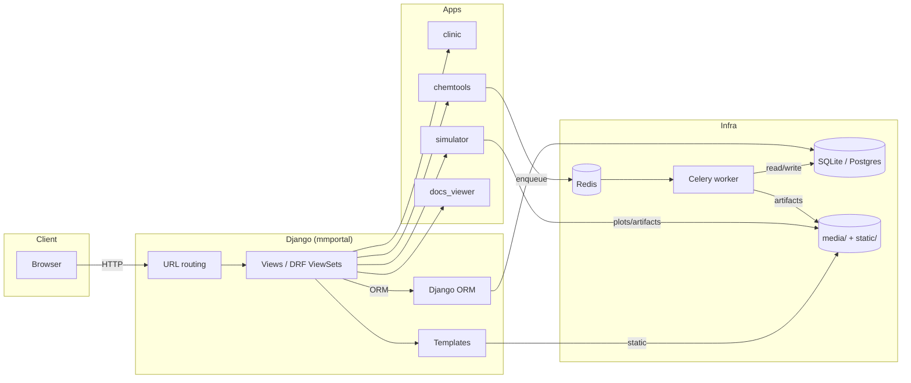
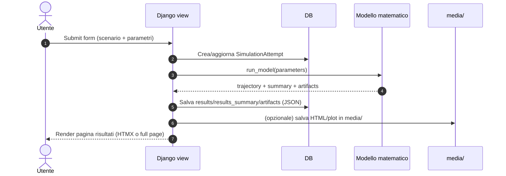
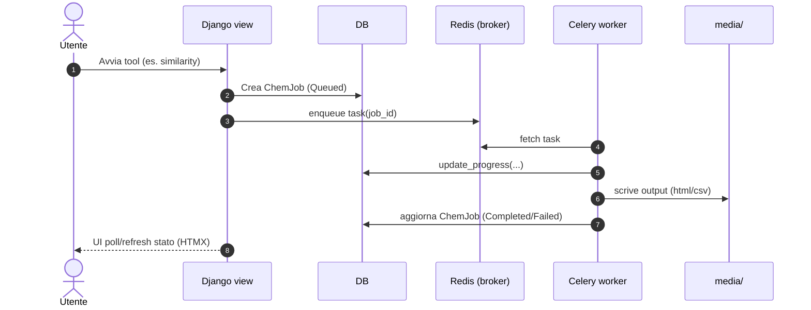

# Architecture

## Cos’è bmyCure4MM

bmyCure4MM è un’applicazione web **Django** orientata a:

- **Clinic**: gestione pazienti/assessment/terapie (CRUD + timeline)
- **Simulator**: scenari clinici e simulazioni (PK/PD, patient twin, reportistica)
- **ChemTools**: tool di chem-informatics (job asincroni + output in media)
- **Docs Viewer**: viewer interno per documentazione Markdown (analytics + feedback)

La root app Django è `mmportal/`.

## Componenti (vista di insieme)



!!! note "Frontend"
    La UI è principalmente server-rendered (Django templates) con interazioni incremental-update tramite **HTMX**.

## Apps (responsabilità)

### `clinic`

- Anagrafica paziente (`Patient`) + ownership minimo (`owner`)
- Assessment clinici (`Assessment`)
- Regimen (`Regimen`) riusati anche dal simulator
- Terapie per paziente (`PatientTherapy`)
- Citogenetica (catalogo + storico)

### `simulator`

- Scenario didattici (`Scenario`)
- Esecuzione simulazione e persistenza risultati (`SimulationAttempt`)
- “Patient twin” e preset PK/PD (`simulator/presets/`)
- API dedicate e audit UX (`api_*.py`, `api_ux.py`)

### `chemtools`

- Job di utilità (parametri, similarity, binding) tracciati da `ChemJob`
- Output salvati in `MEDIA_ROOT` (HTML/CSV) con progress tracking

### `docs_viewer`

- Render e navigazione documenti Markdown interni
- Analytics e feedback (`DocumentView`, `DocumentFeedback`)

## Flussi principali

### Flusso: simulazione (Scenario → Attempt → Results)



### Flusso: chemtools (job asincrono)



## Dati e persistenza

- Default database: `db.sqlite3` (sviluppo)
- In produzione: consigliato Postgres

La guida completa allo schema è in `Guides → Database`.

## Punti operativi

- Static: `mmportal/static/` → `collectstatic` in produzione
- Media: `media/` (artifact e upload)
- Logs: `logs/` (Django + activity + Celery)

Vedi anche `Guides → Operations` e `Reference → Configuration`.
│   └── utils.py           # Chemical calculations
├── clinic/                # Patient management app
├── docs_viewer/           # Documentation system
├── modules/               # Standalone modules
│   ├── binding_visualizer/
│   └── lipinski_analyzer/
├── pipelines/             # Data processing pipelines
├── lab/                   # Research notebooks
├── templates/             # HTML templates
├── static/                # CSS, JS, images
├── media/                 # User uploads
├── docs/                  # Documentation
└── tests/                 # Test suites
```

## Design Patterns

### Models
- **Fat Models, Thin Views**: Business logic in models
- **Form Validation**: Educational error messages with clinical context
- **Mixins**: Reusable model behaviors

### Views
- **Class-Based Views**: For CRUD operations
- **HTMX Partials**: For dynamic page updates
- **API ViewSets**: For REST endpoints

### Tasks
- **Asynchronous Processing**: Long-running computations
- **Progress Tracking**: Real-time status updates
- **Error Handling**: Graceful failure with logging

## Security Considerations

### Authentication & Authorization
- Django's built-in authentication
- Login required for sensitive operations
- User-scoped data access

### Input Validation
- Form-level validation with `clean()` methods
- Model-level validation
- API serializer validation
- XSS prevention through template escaping

### Secrets Management
- Environment variables for sensitive data
- `.env` files (not committed)
- No hardcoded credentials

## Performance Optimization

### Caching
- Structure caching (PDB files, molecules)
- Query result caching
- Static file compression

### Database
- Indexed fields for frequent queries
- Select/prefetch related for N+1 prevention
- Connection pooling

### Background Processing
- Celery for CPU-intensive tasks
- Redis for fast task queuing
- Result caching

## Monitoring & Logging

### Application Logging
```python
# Activity logging
LOGGING = {
    'loggers': {
        'activity': {...},        # User actions
        'ux.education': {...},    # Educational interactions
        'chemtools.tasks': {...}, # Background tasks
        'celery': {...},          # Task queue
    }
}
```

### Log Files
- `logs/activity.log` - User activity tracking
- `logs/django.log` - Application errors
- `logs/celery_tasks.log` - Background job status

## Deployment

### Development

**First-time setup:**
```bash
# 1. Generate a secure SECRET_KEY
python -c 'from django.core.management.utils import get_random_secret_key; print(get_random_secret_key())'

# 2. Create .env file from template
cp .env.example .env

# 3. Edit .env and set DJANGO_SECRET_KEY to the generated value
# DJANGO_SECRET_KEY=<paste-generated-key-here>

# 4. Start development server
./start_dev.sh  # Redis + Celery + Django
```

**Quick start (after initial setup):**
```bash
./start_dev.sh  # Redis + Celery + Django
```

### Production Checklist
- [ ] Set `DJANGO_DEBUG=0`
- [ ] Generate and set strong `DJANGO_SECRET_KEY` (REQUIRED - see above)
- [ ] Set `ALLOWED_HOSTS` to your domain(s)
- [ ] Use PostgreSQL instead of SQLite
- [ ] Enable HTTPS
- [ ] Configure static file serving (WhiteNoise/CDN)
- [ ] Set up proper logging/monitoring
- [ ] Configure backup strategy
- [ ] Enable error tracking (Sentry)

**Security Validation:**
The application will automatically refuse to start if:
- `DJANGO_SECRET_KEY` is not set
- `DJANGO_SECRET_KEY` contains "insecure"
- `DJANGO_SECRET_KEY` matches known default values

## Future Architecture Considerations

### Scalability
- Migrate to PostgreSQL for production
- Add caching layer (Redis/Memcached)
- Load balancing for multiple workers
- Database read replicas

### Microservices (if needed)
- Separate computation service
- Dedicated API gateway
- Message queue (RabbitMQ/Kafka)

### Cloud Deployment
- Container orchestration (Kubernetes)
- Managed services (AWS RDS, ElastiCache)
- CDN for static assets
- Auto-scaling groups

---

For implementation details, see [Development Guide](../development/DEVELOPMENT.md).
