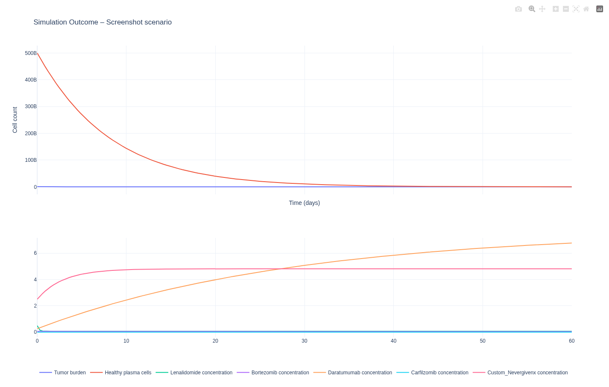

# Custom drug (experimental)

=== "IT"

    Questa guida descrive come usare la funzione **Custom drug (experimental)** nel Simulatore per esplorare scenari *what‑if* con un agente non presente nei preset YAML.

    !!! warning "Uso previsto (e cosa NON è)"
        - È una modalità **sperimentale** per ricerca/esplorazione e didattica.
        - **Non** è una previsione clinica dell’efficacia su pazienti reali.
        - I parametri PK/PD inseriti sono **assunzioni**: la qualità dell’output dipende direttamente da quanto sono plausibili.

    ## Dove si trova

    - Vai a **Simulator → scenario → Simulate**.
    - Nel form parametri, se sei **editor/staff**, trovi la card **Custom drug (experimental)** (sezione “Advanced & Twin”).

    ## Permessi e privacy

    - La funzione è **editor-only**: se un utente non autorizzato la abilita, viene **disattivata automaticamente** con un warning.
    - Non richiede dati paziente: puoi usarla su scenari demo senza Patient Twin.

    ## Cosa devi inserire

    **Input minimi** (tutti richiesti quando abilitata):

    - **Name**: etichetta del farmaco (solo per output/colonne).
    - **Dose (total)**: dose totale sull’orizzonte simulato.
    - **PK half-life (hours)**: emivita in ore.
    - **PK Vd**: volume di distribuzione (unità arbitrarie ma coerenti).
    - **PD Emax (0–1)**: effetto massimo.
    - **PD EC50**: concentrazione a metà effetto (deve essere > 0).

    !!! note "Chiave/colonna generata"
        Il sistema genera una chiave stabile (es. `custom_nevergivenx`) usata per:

        - `auc[custom_*]` nel summary
        - colonna `custom_*_concentration` nel CSV
        - curva di concentrazione nel plot

    ## Cosa ottieni

    - Un nuovo profilo PK/PD viene inserito come **fallback** (senza YAML) e usato dal solver.
    - Nel risultato avrai:
        - **AUC** per la chiave custom
        - curva di concentrazione nel plot

    Per capire come interpretare **AUC** e gli altri KPI del `results_summary`, vedi:

    - `Guides → Docs → Simulator KPIs (How to Read)`

    

    ## Esempio rapido (valori plausibili “toy”)

    - Dose total: 100
    - half-life: 48 h
    - Vd: 40
    - Emax: 0.6
    - EC50: 2.0

    **Atteso**: vedi una nuova curva nel plot e una nuova chiave in AUC.

=== "EN"

    This guide describes **Custom drug (experimental)** in the Simulator: a *what‑if* mode for an agent not present in YAML presets.

    !!! warning "Intended use (and what it is NOT)"
        - **Experimental** research/education mode.
        - **Not** a clinical prediction for real patients.
        - PK/PD parameters are **assumptions**: output quality depends on their plausibility.

    ## Where to find it

    - Go to **Simulator → scenario → Simulate**.
    - If you are **editor/staff**, the form shows a **Custom drug (experimental)** card under “Advanced & Twin”.

    ## Permissions & privacy

    - **Editor-only**: non-privileged users will have it auto-disabled with a warning.
    - No patient data is required: it can run on demo scenarios without Patient Twin.

    ## Required inputs

    - **Name**: label only (for outputs/columns).
    - **Dose (total)**: total administered amount across the horizon.
    - **PK half-life (hours)**
    - **PK Vd**
    - **PD Emax (0–1)**
    - **PD EC50** (> 0)

    !!! note "Generated key"
        The system generates a stable key (e.g. `custom_nevergivenx`) used for:

        - `auc[custom_*]` in the summary
        - `custom_*_concentration` column in CSV
        - concentration curve in the plot

    ## Outputs

    - The custom PK/PD profile is injected as a **fallback** (no YAML required) and used by the solver.
    - Results include:
        - **AUC** for the custom key
        - concentration curve in the plot

    For how to interpret **AUC** and other `results_summary` KPIs, see:

    - `Guides → Docs → Simulator KPIs (How to Read)`

    

    ## Quick example (toy values)

    - total dose: 100
    - half-life: 48 h
    - Vd: 40
    - Emax: 0.6
    - EC50: 2.0

    **Expected**: a new curve in the plot and a new AUC key.
