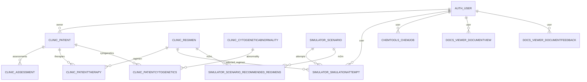

# Database

Questa applicazione usa **Django ORM** con database **SQLite** in default (`db.sqlite3`), configurato in `mmportal/settings.py`.

!!! warning "Ambito"
    Questa pagina descrive:
    - lo **schema applicativo** attuale (tabelle presenti in `db.sqlite3`)
    - le **entità Django** (model) e le loro relazioni
    
    Nota: alcune classi presenti nel codice potrebbero non avere ancora una migration applicata (es. `clinic.models_symptoms.SymptomAssessment`).

!!! tip "Non trovi un oggetto DB?"
    Vai su `Reference → Database Objects` per la mappa **Model ↔ Tabella ↔ File** e esempi rapidi (ORM/SQL).

## Panoramica entità (ER)



## Configurazione DB (runtime)

- Engine: `django.db.backends.sqlite3`
- File: `db.sqlite3`
- Default: nessun utente/password (SQLite locale)

Per produzione, valutare Postgres (Django compatibile) e migrazioni standard (`python manage.py migrate`).

## Tabelle applicative (attuali)

### `clinic_patient`

Contiene anagrafica paziente e ownership minimale.

| Campo | Tipo | NULL | Note |
| --- | --- | --- | --- |
| `id` | INTEGER | no | PK |
| `mrn` | varchar(32) | no | Unique |
| `owner_id` | INTEGER | sì | FK → `auth_user.id` |
| `first_name` | varchar(64) | no |  |
| `last_name` | varchar(64) | no |  |
| `birth_date` | date | no |  |
| `sex` | varchar(1) | no | choices `M/F/O` |
| `diagnosis_date` | date | no |  |
| `notes` | TEXT | no | in Django: `blank=True` |

Indici:
- `sqlite_autoindex_clinic_patient_1` su `mrn` (unique)
- `clinic_patient_owner_id_e445f087` su `owner_id`

### `clinic_assessment`

Snapshot laboratoristico per valutazioni IMWG + note.

| Campo | Tipo | NULL | Note |
| --- | --- | --- | --- |
| `id` | INTEGER | no | PK |
| `patient_id` | bigint | no | FK → `clinic_patient.id` |
| `date` | date | no | ordinamento `-date` |
| `m_protein_g_dl` | decimal | sì |  |
| `kappa_mg_l` | decimal | sì |  |
| `lambda_mg_l` | decimal | sì |  |
| `flc_ratio` | decimal | sì |  |
| `hemoglobin_g_dl` | decimal | sì |  |
| `calcium_mg_dl` | decimal | sì |  |
| `creatinine_mg_dl` | decimal | sì |  |
| `beta2m_mg_l` | decimal | sì |  |
| `albumin_g_dl` | decimal | sì |  |
| `ldH_u_l` | decimal | sì |  |
| `r_iss` | varchar(4) | no | choices `I/II/III` (stringa vuota ammessa in Django) |
| `response` | varchar(4) | no | choices `sCR/CR/VGPR/PR/SD/PD` (stringa vuota ammessa) |
| `notes` | TEXT | no |  |

Indice:
- `clinic_assessment_patient_id_fadeb20a` su `patient_id`

### `clinic_regimen`

Definizione di regimen terapeutici (riusati da Clinic e Simulator).

| Campo | Tipo | NULL | Note |
| --- | --- | --- | --- |
| `id` | INTEGER | no | PK |
| `name` | varchar(128) | no |  |
| `line` | varchar(64) | no | es. frontline/salvage |
| `components` | TEXT | no | agenti comma-separated |
| `intent` | varchar(128) | no | blank in Django, ma in DB è `NOT NULL` (stringa vuota) |
| `notes` | TEXT | no | blank in Django, ma in DB è `NOT NULL` (stringa vuota) |

### `clinic_patienttherapy`

Timeline delle terapie per paziente.

| Campo | Tipo | NULL | Note |
| --- | --- | --- | --- |
| `id` | INTEGER | no | PK |
| `patient_id` | bigint | no | FK → `clinic_patient.id` |
| `regimen_id` | bigint | no | FK → `clinic_regimen.id` |
| `start_date` | date | no |  |
| `end_date` | date | sì |  |
| `outcome` | varchar(128) | no | blank in Django, ma `NOT NULL` |
| `adverse_events` | TEXT | no | blank in Django, ma `NOT NULL` |

Indici:
- `clinic_patienttherapy_patient_id_4699d56d` su `patient_id`
- `clinic_patienttherapy_regimen_id_d266910c` su `regimen_id`

### `clinic_cytogeneticabnormality`

Catalogo di anomalie citogenetiche.

| Campo | Tipo | NULL | Note |
| --- | --- | --- | --- |
| `id` | INTEGER | no | PK |
| `code` | varchar(32) | no | unique |
| `description` | varchar(255) | no |  |

Indice:
- `sqlite_autoindex_clinic_cytogeneticabnormality_1` su `code` (unique)

### `clinic_patientcytogenetics`

Storico anomalie per paziente.

| Campo | Tipo | NULL | Note |
| --- | --- | --- | --- |
| `id` | INTEGER | no | PK |
| `patient_id` | bigint | no | FK → `clinic_patient.id` |
| `abnormality_id` | bigint | no | FK → `clinic_cytogeneticabnormality.id` |
| `detected_on` | date | no |  |
| `method` | varchar(128) | no | blank in Django, ma `NOT NULL` |

Indici:
- `clinic_patientcytogenetics_patient_id_033e4053` su `patient_id`
- `clinic_patientcytogenetics_abnormality_id_9961fbcd` su `abnormality_id`
- Unique composito: `patient_id, abnormality_id, detected_on`

### `simulator_scenario`

Scenario clinici “didattici” + parametri clinici/biologici.

Campi chiave (estratto):

- Identità e metadati: `title`, `clinical_stage`, `summary`, `active`, `created`, `updated`
- Risk: `riss_stage`, citogenetica booleana (`del17p`, `t_4_14`, `t_14_16`, `gain_1q21`, `hyperdiploid`, `t_11_14`)
- Lab/clinica: `albumin`, `beta2_microglobulin`, `ldh`, `hemoglobin`, `calcium`, `creatinine_clearance`
- Biologia: `tumor_cell_count`, `tumor_growth_rate`, `carrying_capacity`
- Didattica: `difficulty_score`, `difficulty_level`, `patient_archetype`

!!! note "JSON in SQLite"
    Campi Django `JSONField` sono memorizzati come `TEXT` in SQLite (stringa JSON serializzata).

### `simulator_simulationattempt`

Tentativi utente su uno scenario.

Relazioni:
- `scenario_id` → `simulator_scenario.id`
- `user_id` → `auth_user.id` (nullable)
- `selected_regimen_id` → `clinic_regimen.id` (nullable)

Payload:
- `parameters` (JSON)
- `results` (JSON)
- `results_summary` (JSON)
- `artifacts` (JSON)

### `simulator_scenario_recommended_regimens`

Tabella di join M2M (`Scenario.recommended_regimens`).

Unique composito: `scenario_id, regimen_id`

### `chemtools_chemjob`

Tracking delle esecuzioni (job) di strumenti di chem-informatics.

Relazione:
- `user_id` → `auth_user.id` (nullable)

Campi di stato:
- `progress_percent`, `progress_message`, `log`
- output: `out_html`, `out_csv` (FileField → path)

### `docs_viewer_documentview` / `docs_viewer_documentfeedback`

Analytics e feedback per il viewer di documentazione interno.

## Tabelle Django (standard)

L’istanza SQLite include anche le tabelle standard:
- `auth_*` (utenti, gruppi, permessi)
- `django_*` (sessioni, admin log, migrations, content types)

## Modelli presenti nel codice ma non in DB (attenzione)

### `clinic.models_symptoms.SymptomAssessment`

Esiste nel codice ma **non risulta** tra le tabelle in `db.sqlite3` (manca migration applicata o non creata).

Checklist per allineare:

```bash
python3 manage.py makemigrations clinic
python3 manage.py migrate
```

## DDL completo (SQLite)

Questa sezione riporta le definizioni **esatte** delle tabelle (output `sqlite3 db.sqlite3 ".schema <table>"`).

??? example "`clinic_patient`"
    ```sql
    CREATE TABLE IF NOT EXISTS "clinic_patient" ("id" integer NOT NULL PRIMARY KEY AUTOINCREMENT, "mrn" varchar(32) NOT NULL UNIQUE, "first_name" varchar(64) NOT NULL, "last_name" varchar(64) NOT NULL, "birth_date" date NOT NULL, "sex" varchar(1) NOT NULL, "diagnosis_date" date NOT NULL, "notes" text NOT NULL, "owner_id" integer NULL REFERENCES "auth_user" ("id") DEFERRABLE INITIALLY DEFERRED);
    CREATE INDEX "clinic_patient_owner_id_e445f087" ON "clinic_patient" ("owner_id");
    ```

??? example "`clinic_assessment`"
    ```sql
    CREATE TABLE IF NOT EXISTS "clinic_assessment" ("id" integer NOT NULL PRIMARY KEY AUTOINCREMENT, "date" date NOT NULL, "m_protein_g_dl" decimal NULL, "kappa_mg_l" decimal NULL, "lambda_mg_l" decimal NULL, "flc_ratio" decimal NULL, "hemoglobin_g_dl" decimal NULL, "calcium_mg_dl" decimal NULL, "creatinine_mg_dl" decimal NULL, "beta2m_mg_l" decimal NULL, "albumin_g_dl" decimal NULL, "ldH_u_l" decimal NULL, "r_iss" varchar(4) NOT NULL, "response" varchar(4) NOT NULL, "notes" text NOT NULL, "patient_id" bigint NOT NULL REFERENCES "clinic_patient" ("id") DEFERRABLE INITIALLY DEFERRED);
    CREATE INDEX "clinic_assessment_patient_id_fadeb20a" ON "clinic_assessment" ("patient_id");
    ```

??? example "`clinic_regimen`"
    ```sql
    CREATE TABLE IF NOT EXISTS "clinic_regimen" ("id" integer NOT NULL PRIMARY KEY AUTOINCREMENT, "name" varchar(128) NOT NULL, "line" varchar(64) NOT NULL, "components" text NOT NULL, "intent" varchar(128) NOT NULL, "notes" text NOT NULL);
    ```

??? example "`clinic_patienttherapy`"
    ```sql
    CREATE TABLE IF NOT EXISTS "clinic_patienttherapy" ("id" integer NOT NULL PRIMARY KEY AUTOINCREMENT, "start_date" date NOT NULL, "end_date" date NULL, "outcome" varchar(128) NOT NULL, "adverse_events" text NOT NULL, "patient_id" bigint NOT NULL REFERENCES "clinic_patient" ("id") DEFERRABLE INITIALLY DEFERRED, "regimen_id" bigint NOT NULL REFERENCES "clinic_regimen" ("id") DEFERRABLE INITIALLY DEFERRED);
    CREATE INDEX "clinic_patienttherapy_patient_id_4699d56d" ON "clinic_patienttherapy" ("patient_id");
    CREATE INDEX "clinic_patienttherapy_regimen_id_d266910c" ON "clinic_patienttherapy" ("regimen_id");
    ```

??? example "`clinic_cytogeneticabnormality`"
    ```sql
    CREATE TABLE IF NOT EXISTS "clinic_cytogeneticabnormality" ("id" integer NOT NULL PRIMARY KEY AUTOINCREMENT, "code" varchar(32) NOT NULL UNIQUE, "description" varchar(255) NOT NULL);
    ```

??? example "`clinic_patientcytogenetics`"
    ```sql
    CREATE TABLE IF NOT EXISTS "clinic_patientcytogenetics" ("id" integer NOT NULL PRIMARY KEY AUTOINCREMENT, "detected_on" date NOT NULL, "method" varchar(128) NOT NULL, "abnormality_id" bigint NOT NULL REFERENCES "clinic_cytogeneticabnormality" ("id") DEFERRABLE INITIALLY DEFERRED, "patient_id" bigint NOT NULL REFERENCES "clinic_patient" ("id") DEFERRABLE INITIALLY DEFERRED);
    CREATE UNIQUE INDEX "clinic_patientcytogenetics_patient_id_abnormality_id_detected_on_f4d7d6ce_uniq" ON "clinic_patientcytogenetics" ("patient_id", "abnormality_id", "detected_on");
    CREATE INDEX "clinic_patientcytogenetics_abnormality_id_9961fbcd" ON "clinic_patientcytogenetics" ("abnormality_id");
    CREATE INDEX "clinic_patientcytogenetics_patient_id_033e4053" ON "clinic_patientcytogenetics" ("patient_id");
    ```

??? example "`simulator_scenario`"
    ```sql
    CREATE TABLE IF NOT EXISTS "simulator_scenario" ("id" integer NOT NULL PRIMARY KEY AUTOINCREMENT, "title" varchar(200) NOT NULL, "clinical_stage" varchar(32) NOT NULL, "summary" text NOT NULL, "risk_stratification" varchar(128) NOT NULL, "lab_snapshot" text NOT NULL CHECK ((JSON_VALID("lab_snapshot") OR "lab_snapshot" IS NULL)), "guideline_notes" text NOT NULL, "expected_response" varchar(4) NOT NULL, "created" datetime NOT NULL, "updated" datetime NOT NULL, "active" bool NOT NULL, "del17p" bool NOT NULL, "t_4_14" bool NOT NULL, "t_14_16" bool NOT NULL, "gain_1q21" bool NOT NULL, "hyperdiploid" bool NOT NULL, "t_11_14" bool NOT NULL, "tumor_cell_count" real NULL, "tumor_growth_rate" real NULL, "carrying_capacity" real NULL, "patient_age" integer NULL, "ecog_performance_status" integer NULL, "charlson_comorbidity_index" integer NULL, "creatinine_clearance" real NULL, "albumin" real NULL, "beta2_microglobulin" real NULL, "ldh" real NULL, "hemoglobin" real NULL, "calcium" real NULL, "riss_stage" varchar(16) NOT NULL, "patient_archetype" varchar(32) NOT NULL, "difficulty_score" real NULL, "difficulty_level" varchar(16) NOT NULL);
    ```

??? example "`simulator_simulationattempt`"
    ```sql
    CREATE TABLE IF NOT EXISTS "simulator_simulationattempt" ("id" integer NOT NULL PRIMARY KEY AUTOINCREMENT, "predicted_response" varchar(4) NOT NULL, "confidence" smallint unsigned NOT NULL CHECK ("confidence" >= 0), "notes" text NOT NULL, "submitted" datetime NOT NULL, "is_guideline_aligned" bool NOT NULL, "scenario_id" bigint NOT NULL REFERENCES "simulator_scenario" ("id") DEFERRABLE INITIALLY DEFERRED, "selected_regimen_id" bigint NULL REFERENCES "clinic_regimen" ("id") DEFERRABLE INITIALLY DEFERRED, "user_id" integer NULL REFERENCES "auth_user" ("id") DEFERRABLE INITIALLY DEFERRED, "parameters" text NOT NULL CHECK ((JSON_VALID("parameters") OR "parameters" IS NULL)), "results" text NOT NULL CHECK ((JSON_VALID("results") OR "results" IS NULL)), "results_summary" text NOT NULL CHECK ((JSON_VALID("results_summary") OR "results_summary" IS NULL)), "artifacts" text NOT NULL CHECK ((JSON_VALID("artifacts") OR "artifacts" IS NULL)), "cohort_size" integer unsigned NOT NULL CHECK ("cohort_size" >= 0), "seed" integer NULL);
    CREATE INDEX "simulator_simulationattempt_scenario_id_10da45ec" ON "simulator_simulationattempt" ("scenario_id");
    CREATE INDEX "simulator_simulationattempt_selected_regimen_id_dc00bf75" ON "simulator_simulationattempt" ("selected_regimen_id");
    CREATE INDEX "simulator_simulationattempt_user_id_3a3fee5c" ON "simulator_simulationattempt" ("user_id");
    ```

??? example "`simulator_scenario_recommended_regimens`"
    ```sql
    CREATE TABLE IF NOT EXISTS "simulator_scenario_recommended_regimens" ("id" integer NOT NULL PRIMARY KEY AUTOINCREMENT, "scenario_id" bigint NOT NULL REFERENCES "simulator_scenario" ("id") DEFERRABLE INITIALLY DEFERRED, "regimen_id" bigint NOT NULL REFERENCES "clinic_regimen" ("id") DEFERRABLE INITIALLY DEFERRED);
    CREATE UNIQUE INDEX "simulator_scenario_recommended_regimens_scenario_id_regimen_id_7d50b672_uniq" ON "simulator_scenario_recommended_regimens" ("scenario_id", "regimen_id");
    CREATE INDEX "simulator_scenario_recommended_regimens_scenario_id_96f316b1" ON "simulator_scenario_recommended_regimens" ("scenario_id");
    CREATE INDEX "simulator_scenario_recommended_regimens_regimen_id_75c960bf" ON "simulator_scenario_recommended_regimens" ("regimen_id");
    ```

??? example "`chemtools_chemjob`"
    ```sql
    CREATE TABLE IF NOT EXISTS "chemtools_chemjob" ("id" integer NOT NULL PRIMARY KEY AUTOINCREMENT, "kind" varchar(10) NOT NULL, "created" datetime NOT NULL, "input_a" varchar(255) NOT NULL, "input_b" varchar(255) NOT NULL, "out_html" varchar(100) NULL, "out_csv" varchar(100) NULL, "log" text NOT NULL, "user_id" integer NULL REFERENCES "auth_user" ("id") DEFERRABLE INITIALLY DEFERRED, "progress_message" varchar(255) NOT NULL, "progress_percent" integer NOT NULL, "api_preferences" text NOT NULL CHECK ((JSON_VALID("api_preferences") OR "api_preferences" IS NULL)));
    CREATE INDEX "chemtools_chemjob_user_id_cd161adb" ON "chemtools_chemjob" ("user_id");
    ```

??? example "`docs_viewer_documentview`"
    ```sql
    CREATE TABLE IF NOT EXISTS "docs_viewer_documentview" ("id" integer NOT NULL PRIMARY KEY AUTOINCREMENT, "path" varchar(255) NOT NULL, "viewed_at" datetime NOT NULL, "user_id" integer NULL REFERENCES "auth_user" ("id") DEFERRABLE INITIALLY DEFERRED);
    CREATE INDEX "docs_viewer_documentview_path_c76b9211" ON "docs_viewer_documentview" ("path");
    CREATE INDEX "docs_viewer_documentview_viewed_at_8cf81ea9" ON "docs_viewer_documentview" ("viewed_at");
    CREATE INDEX "docs_viewer_documentview_user_id_7a33112e" ON "docs_viewer_documentview" ("user_id");
    ```

??? example "`docs_viewer_documentfeedback`"
    ```sql
    CREATE TABLE IF NOT EXISTS "docs_viewer_documentfeedback" ("id" integer NOT NULL PRIMARY KEY AUTOINCREMENT, "path" varchar(255) NOT NULL, "rating" integer NOT NULL, "comment" text NOT NULL, "created_at" datetime NOT NULL, "user_id" integer NULL REFERENCES "auth_user" ("id") DEFERRABLE INITIALLY DEFERRED);
    CREATE UNIQUE INDEX "docs_viewer_documentfeedback_path_user_id_564fdac8_uniq" ON "docs_viewer_documentfeedback" ("path", "user_id");
    CREATE INDEX "docs_viewer_documentfeedback_path_478cafa8" ON "docs_viewer_documentfeedback" ("path");
    CREATE INDEX "docs_viewer_documentfeedback_user_id_95fa45fa" ON "docs_viewer_documentfeedback" ("user_id");
    ```
