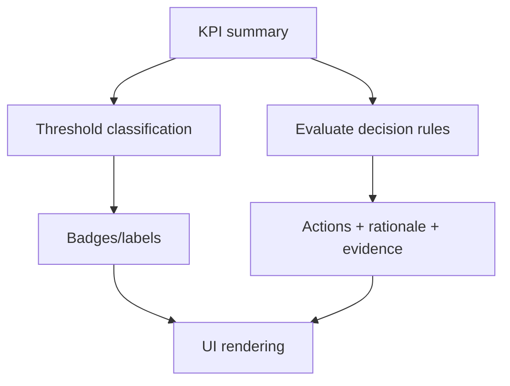
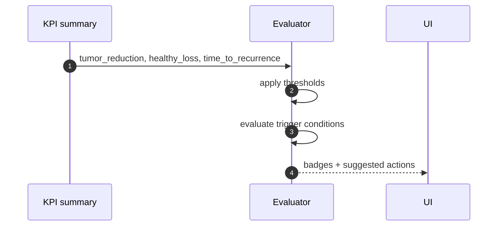

# Decision Algorithm (trasparenza e audit)

Questa guida descrive l’algoritmo decisionale dichiarativo (rule-based) esposto in `simulator/decision_algorithm.py`.

## Perché esiste

L’obiettivo è rendere:

- **trasparenti** soglie e regole
- **auditabili** le raccomandazioni
- **versionabili** i cambi di policy

## Struttura dati

Il file espone un dizionario `DECISION_ALGORITHM` con:

- `version` e `last_updated`
- `thresholds`: classificazioni (efficacy/toxicity/durability)
- `decision_rules`: regole attivabili da trigger condition
- `risk_stratification`: schema R-ISS (descrittivo)
- `high_risk_cytogenetics`: impatto e management per marker

## Soglie principali (KPI → badge)

### Efficacy

Basato su `tumor_reduction`:

- good: `>= 0.50`
- moderate: `0.30–0.49`
- poor: `< 0.30`
- failure: `< 0` (crescita tumorale)

### Toxicity

Basato su `healthy_loss`:

- acceptable: `< 0.20`
- borderline: `0.20–0.29`
- high: `>= 0.30`

### Durability

Basato su `time_to_recurrence` (giorni):

- good: `>= 180`
- moderate: `90–179`
- poor: `< 90`

## Regole (decision_rules)

Ogni regola contiene:

- `trigger_condition` (espressione logica su KPI)
- `priority`
- `action` (EN/IT)
- `rationale` (EN/IT)
- `evidence` (lista riferimenti testuali)
- (opzionale) `suggested_alternatives`

Esempio di flusso:

## Versioning e date (importante)

`ALGORITHM_UPDATED` è una data ISO (es. `2026-01-17`) e va aggiornata quando:

- cambiano soglie
- si aggiungono regole
- si cambia wording clinico rilevante

!!! tip "Buona pratica"
    Tratta l’algoritmo come “policy as code”: review, changelog, test automatici sulle condizioni critiche.

