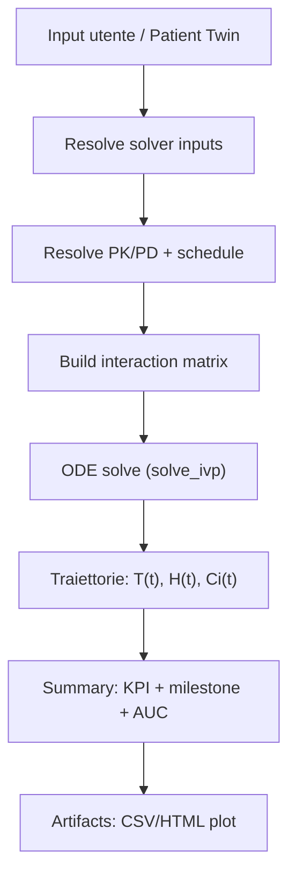
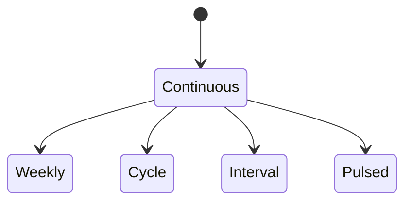

# Mathematical Models (teoria + implementazione)

Questa pagina descrive i **modelli matematici** usati nel simulatore e come vengono tradotti nell’implementazione.

!!! warning "Nota importante"
    Questa documentazione descrive un **modello didattico/di ricerca** e la sua implementazione software.
    Non sostituisce giudizio clinico, linee guida o validazione regolatoria.

!!! info "Dove guardare nel codice"
    - Modello usato dalla simulazione “runtime”: `simulator/models_simulation.py` (`MathematicalModel.simulate`)
    - Formulazioni/varianti documentate: `simulator/mathematical_models.py`
    - Pipeline end-to-end (parametri → ODE → summary → artifact): `simulator/models.py` (`SimulationAttempt.run_model`)
    - Preset PK/PD e schedule: `simulator/pharmaco/registry.py`

## Glossario (terminologia)

Questa sezione chiarisce i termini che ricorrono in tutta la pagina.

- **ODE** (*Ordinary Differential Equation*): equazione differenziale ordinaria; descrive come una variabile cambia nel tempo.
- **Stato** (*state vector*): insieme delle variabili che il solver integra (qui: \(T, H, C_i\)).
- **Condizioni iniziali**: valori di stato all’inizio della simulazione (es. \(T(0)\)).
- **Parametro**: valore numerico che controlla il comportamento del sistema (es. \(r_T\), \(EC50\)).
- **Unità**: dimensione fisica coerente del parametro (es. 1/giorno, giorni, mg/L).
- **Carrying capacity** (\(K\)): livello massimo sostenibile (limite superiore della crescita).
- **Half-life** (\(t_{1/2}\)): tempo in cui la concentrazione si dimezza (PK).
- **Elimination rate** (\(k_{elim}\)): costante di eliminazione \(k=\ln(2)/t_{1/2}\).
- **Schedule** (\(u(t)\)): funzione di input dose/tempo (continua o pulsata).
- **AUC**: area sotto la curva di concentrazione \(C(t)\): proxy di “esposizione totale”.
- **KPI**: indicatori riassuntivi calcolati dalle traiettorie (es. `tumor_reduction`).

## Vista d’insieme (pipeline)

!!! tip "Come leggere questa pagina"
    - Se ti serve il quadro generale: leggi **pipeline** + **Glossario** + **KPI**.
    - Se ti serve capire “perché”: leggi le sezioni **Terminologia** e **Esempi** dentro ogni capitolo.
    - Se ti serve il mapping codice: segui i riferimenti ai file indicati in alto.

## Variabili di stato

### Terminologia (questa sezione)

- \(t\): tempo (nel runtime in **giorni**)
- \(T(t)\): carico tumorale (conteggio cellule, o proxy scalare)
- \(H(t)\): compartimento “healthy” (proxy di riserva/comparto sano)
- \(C_i(t)\): concentrazione del farmaco \(i\) (unità “a.u.” nel modello; coerente internamente)

Nel modello “runtime” lo stato include:

- \(T(t)\): tumor cells (carico tumorale)
- \(H(t)\): healthy cells (proxy di “tessuto sano / plasmacellule sane”)
- \(C_i(t)\): concentrazione del farmaco \(i\)

### Esempio (intuizione)

Se pensi alla simulazione come a una “previsione meteo”:

- \(T(t)\) è “quanta pioggia” (malattia) rimane
- \(H(t)\) è “quanto è robusto l’organismo” (comparto sano)
- \(C_i(t)\) è “quanta terapia circola” nel tempo (dipende dalla schedule)

## Equazioni (implementazione runtime)

### Crescita e kill (tumore)

#### Terminologia

- \(r_T\) (*growth rate*): quanto rapidamente cresce il tumore quando è “lontano” dal limite \(K_T\).
- \(K_T\) (*carrying capacity*): limite superiore; la crescita rallenta quando \(T\) si avvicina a \(K_T\).
- \(\sum_i E_i(C_i)\): “forza terapeutica” totale; aumenta con le concentrazioni e dipende dai parametri PD.

Nel codice (`simulator/models_simulation.py`) si usa una **logistica** (non Gompertz) per la crescita:

$$
\frac{dT}{dt} = r_T \, T \left(1 - \frac{T}{K_T}\right) - \Big(\sum_i E_i(C_i)\Big)\,T
$$

Dove:

- \(r_T\): tasso crescita tumorale (1/giorno)
- \(K_T\): carrying capacity tumorale
- \(E_i(C_i)\in[0,1]\): effetto farmacodinamico del farmaco \(i\)

#### Esempio numerico (semplificato)

Prendiamo \(T(0)=10^9\), \(K_T=10^{12}\), \(r_T=0.02/\text{giorno}\).

- senza terapia (\(\sum E_i=0\)) il tumore cresce inizialmente quasi esponenziale
- con terapia moderata (\(\sum E_i \approx 0.03\)) il termine \(-0.03T\) può superare la crescita e far decrescere \(T(t)\)

Grafico illustrativo (solo crescita logistica, diversi \(r_T\)):

### Tessuto sano e tossicità

#### Terminologia

- \(r_H\), \(K_H\): analoghi al tumore ma per il comparto “healthy”.
- \(I\): `immune_compromise_index` (fattore moltiplicativo della tossicità).
- \(\overline{E(C)}\): media degli effetti (proxy di “tossicità media”).

$$
\frac{dH}{dt} = r_H \, H \left(1 - \frac{H}{K_H}\right) - I \cdot \overline{E(C)} \cdot H
$$

- \(r_H\): tasso rinnovo “healthy”
- \(K_H\): carrying capacity “healthy”
- \(\overline{E(C)}\): media degli effetti sui farmaci
- \(I\): `immune_compromise_index` (fattore di vulnerabilità/tossicità)

#### Esempio (interpretazione)

- se \(I\) aumenta, a parità di terapia l’impatto su \(H(t)\) cresce
- ciò si riflette in `healthy_loss` più alto (vedi sezione KPI)

Grafico illustrativo (tumore vs healthy con e senza terapia):

### Farmacocinetica (PK) per ogni farmaco

#### Terminologia

- \(t_{1/2}\): half-life (giorni/ore)
- \(k_{elim}\): tasso di eliminazione (1/giorno)
- \(u_i(t)\): schedule (input rate) che “immette” farmaco nel comparto

$$
\frac{dC_i}{dt} = -k_{elim,i}\,C_i + u_i(t)
$$

- \(k_{elim,i} = \frac{\ln 2}{t_{1/2,i}}\) (convertito in giorni nel runtime)
- \(u_i(t)\): input rate (schedule; continuo o pulsato)

#### Esempio (half-life e schedule)

- half-life breve → concentrazione scende rapidamente tra una somministrazione e l’altra
- schedule pulsata → picchi/valle più evidenti rispetto a input continuo

Grafico illustrativo (PK toy model: continuo vs pulsato):

## Farmacodinamica (PD)

### Emax “base”

#### Terminologia

- \(E_{max}\): effetto massimo teorico (cap a 1 nel runtime)
- \(EC50\): concentrazione che produce metà dell’effetto massimo
- \(C\): concentrazione istantanea (output PK)

Nel runtime:

$$
E_i(C_i) = E_{max,i}\,\frac{C_i}{EC50_i + C_i}
$$

#### Esempio (interpretazione di EC50)

Se due farmaci hanno lo stesso \(E_{max}\) ma \(EC50\) diverso:

- \(EC50\) basso → il farmaco “raggiunge effetto” già a basse concentrazioni
- \(EC50\) alto → serve più concentrazione per un effetto comparabile

Grafico illustrativo (Emax curve, diversi EC50):

### Interazioni tra farmaci

Il runtime calcola prima un vettore \(E\) e poi aggiunge un termine lineare:

$$
E' = \mathrm{clip}(E + A\cdot E,\ 0,\ 1)
$$

Nel codice, \(A\) è costruita come:

- `interaction_matrix = I * interaction_strength` (matrice identità scalata)

Quindi, di default l’interazione è una “amplificazione per-farmaco” proporzionale a `interaction_strength` (non una vera matrice completa di sinergie incrociate).

!!! note "Differenza con `simulator/mathematical_models.py`"
    `simulator/mathematical_models.py` documenta modelli più ricchi (es. Gompertz, interazioni stile Greco).  
    La simulazione effettiva, oggi, usa il modello “compatto” sopra (logistica + Emax + schedule).

## Schedule (dosing function) — teoria e forme supportate

La schedule entra come \(u_i(t)\) e può essere:

Implementazione: `simulator/pharmaco/registry.py` costruisce una funzione \(u(t)\) a partire da YAML:

- `continuous`: input costante \(u(t)=\frac{Dose}{H}\)
- `weekly`: somministra su certi giorni della settimana, per una finestra `administration_window_days`
- `cycle`: somministra per `days_on` dentro un ciclo lungo `cycle_length`
- `interval`: somministra ogni `interval_days`
- `pulsed`: somministra in giorni specifici

## Solver numerico

### Terminologia

- **t_span**: intervallo temporale \([t_0, t_1]\)
- **t_eval**: punti in cui chiediamo al solver di restituire lo stato
- **rtol/atol**: tolleranze (precisione relativa/assoluta)

Runtime:

- Integratore: `scipy.integrate.solve_ivp`
- `rtol=1e-6`, `atol=1e-8`
- campionamento: `evaluation_points=200` (punti equispaziati tra 0 e `time_horizon`)

## Output (traiettorie)

### Terminologia

- **traiettoria**: serie temporale di una variabile (es. \(T(t)\))
- **DataFrame**: tabella in memoria (pandas) usata per calcolare KPI e salvare artifact

La simulazione ritorna una tabella con colonne:

- `time`
- `tumor_cells`
- `healthy_cells`
- `"{drug}_concentration"` per ogni farmaco

## KPI (summary) — definizione formale

### Terminologia (KPI)

- “baseline/start”: valore al tempo iniziale \(t=0\)
- “end”: valore al tempo finale \(t=time\_horizon\)
- KPI “adimensionali”: molte metriche sono rapporti o percentuali (0..1)

Calcolati in `simulator/models.py` dentro `SimulationAttempt.run_model`:

### Tumor reduction

$$
\mathrm{tumor\_reduction} = 1 - \frac{T_{end}}{T_{start}}
$$

Esempio: se \(T_{start}=10^9\) e \(T_{end}=2\cdot10^8\) → `tumor_reduction = 0.8` (80%).

### Healthy loss

$$
\mathrm{healthy\_loss} = 1 - \frac{H_{end}}{H_{start}}
$$

Esempio: se \(H_{start}=5\cdot10^{11}\), \(H_{end}=4.5\cdot10^{11}\) → `healthy_loss = 0.10` (10%).

### Nadir

Tempo e valore minimo di \(T(t)\):

- `nadir.day`: \(t\) di \(\min T(t)\)
- `nadir.tumor_cells`: \(\min T(t)\)
- `nadir.tumor_reduction`: \(1 - \frac{\min T(t)}{T_{start}}\)

### Milestones (30/60/90/end)

Per \(d \in \{30,60,90,\text{end}\}\) si prende il punto più vicino e si salvano:

- `tumor_cells`, `healthy_cells`
- `tumor_reduction` al giorno \(d\)
- `healthy_loss` al giorno \(d\)

### Durability index

Frazione di tempo in cui \(T(t) < T_{start}\):

$$
\mathrm{durability\_index} = \frac{1}{H}\int_0^{H} \mathbf{1}[T(t) < T_{start}]\,dt
$$

### Time to recurrence

Definita come il primo tempo **dopo il nadir** in cui \(T(t)\) supera il 50% del baseline:

$$
T(t) > 0.5\,T_{start}
$$

### AUC per farmaco

$$
\mathrm{AUC}_i = \int_0^{H} C_i(t)\,dt
$$

## Uncertainty / cohort (repliche interne)

### Terminologia

- **coorte**: più repliche della stessa simulazione con parametri perturbati
- **p05/p95**: percentili 5% e 95% (banda d’incertezza)
- **seed**: seme random per riproducibilità

Se `cohort_size > 1`, il sistema genera una coorte interna senza creare record extra:

- Perturba baseline e growth con moltiplicatori log-normali (sigma diversi per T/H)
- Calcola statistiche (mean, p05, p95) per:
  - `tumor_reduction`, `healthy_loss`, `durability_index`, `auc_total`
  - `time_to_recurrence` + `recurrence_rate`
  - milestone (30/60/90/end) per tumor_reduction e healthy_loss

## Patient Twin (come influenza i parametri)

### Terminologia

- **Twin payload**: dizionario di parametri biologici derivati dai lab (`Assessment`)
- **Auto**: sostituisce solo i parametri lasciati “auto” dall’utente
- **Guided choices**: scelte qualitative trasformate in piccoli moltiplicatori

Il patient twin produce un payload con parametri biologici “suggested”.  
In modalità `twin_biology_mode=auto` alcuni valori vengono **iniettati** se l’utente ha lasciato “auto”:

- `tumor_growth_rate`, `healthy_growth_rate`
- `carrying_capacity_tumor`, `carrying_capacity_healthy`
- `immune_compromise_index`

Poi esistono “guided choices” (non numeriche) che applicano piccoli moltiplicatori:

- `guided_tumor_aggressiveness` ∈ {lower, typical, higher}
- `guided_immune_status` ∈ {better, typical, worse}

### Esempio (cosa cambia davvero)

- se `tumor_growth_rate` è “auto”, il Twin può impostarlo (es. 0.035 vs 0.02) in base a rischio e lab
- se l’utente poi sceglie `guided_tumor_aggressiveness=higher`, il runtime applica un moltiplicatore (~1.15) al valore già risolto
