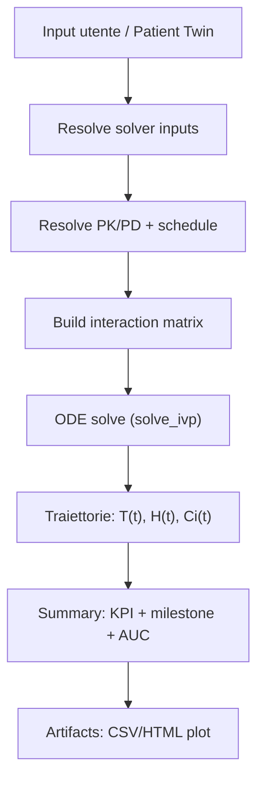
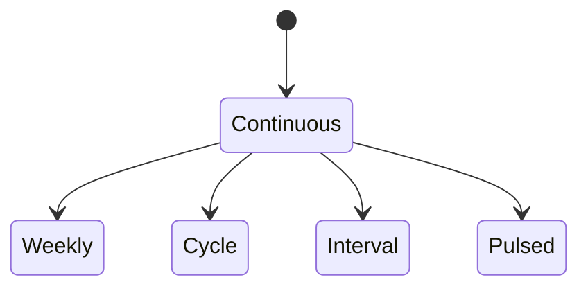

# Mathematical Models (teoria + implementazione)

Questa pagina descrive i **modelli matematici** usati nel simulatore e come vengono tradotti nell’implementazione.

!!! info "Dove guardare nel codice"
    - Modello usato dalla simulazione “runtime”: `simulator/models_simulation.py` (`MathematicalModel.simulate`)
    - Formulazioni/varianti documentate: `simulator/mathematical_models.py`
    - Pipeline end-to-end (parametri → ODE → summary → artifact): `simulator/models.py` (`SimulationAttempt.run_model`)
    - Preset PK/PD e schedule: `simulator/pharmaco/registry.py`

## Vista d’insieme (pipeline)

## Variabili di stato

Nel modello “runtime” lo stato include:

- \(T(t)\): tumor cells (carico tumorale)
- \(H(t)\): healthy cells (proxy di “tessuto sano / plasmacellule sane”)
- \(C_i(t)\): concentrazione del farmaco \(i\)

## Equazioni (implementazione runtime)

### Crescita e kill (tumore)

Nel codice (`simulator/models_simulation.py`) si usa una **logistica** (non Gompertz) per la crescita:

$$
\frac{dT}{dt} = r_T \, T \left(1 - \frac{T}{K_T}\right) - \Big(\sum_i E_i(C_i)\Big)\,T
$$

Dove:

- \(r_T\): tasso crescita tumorale (1/giorno)
- \(K_T\): carrying capacity tumorale
- \(E_i(C_i)\in[0,1]\): effetto farmacodinamico del farmaco \(i\)

### Tessuto sano e tossicità

$$
\frac{dH}{dt} = r_H \, H \left(1 - \frac{H}{K_H}\right) - I \cdot \overline{E(C)} \cdot H
$$

- \(r_H\): tasso rinnovo “healthy”
- \(K_H\): carrying capacity “healthy”
- \(\overline{E(C)}\): media degli effetti sui farmaci
- \(I\): `immune_compromise_index` (fattore di vulnerabilità/tossicità)

### Farmacocinetica (PK) per ogni farmaco

$$
\frac{dC_i}{dt} = -k_{elim,i}\,C_i + u_i(t)
$$

- \(k_{elim,i} = \frac{\ln 2}{t_{1/2,i}}\) (convertito in giorni nel runtime)
- \(u_i(t)\): input rate (schedule; continuo o pulsato)

## Farmacodinamica (PD)

### Emax “base”

Nel runtime:

$$
E_i(C_i) = E_{max,i}\,\frac{C_i}{EC50_i + C_i}
$$

### Interazioni tra farmaci

Il runtime calcola prima un vettore \(E\) e poi aggiunge un termine lineare:

$$
E' = \mathrm{clip}(E + A\cdot E,\ 0,\ 1)
$$

Nel codice, \(A\) è costruita come:

- `interaction_matrix = I * interaction_strength` (matrice identità scalata)

Quindi, di default l’interazione è una “amplificazione per-farmaco” proporzionale a `interaction_strength` (non una vera matrice completa di sinergie incrociate).

!!! note "Differenza con `simulator/mathematical_models.py`"
    `simulator/mathematical_models.py` documenta modelli più ricchi (es. Gompertz, interazioni stile Greco).  
    La simulazione effettiva, oggi, usa il modello “compatto” sopra (logistica + Emax + schedule).

## Schedule (dosing function) — teoria e forme supportate

La schedule entra come \(u_i(t)\) e può essere:

Implementazione: `simulator/pharmaco/registry.py` costruisce una funzione \(u(t)\) a partire da YAML:

- `continuous`: input costante \(u(t)=\frac{Dose}{H}\)
- `weekly`: somministra su certi giorni della settimana, per una finestra `administration_window_days`
- `cycle`: somministra per `days_on` dentro un ciclo lungo `cycle_length`
- `interval`: somministra ogni `interval_days`
- `pulsed`: somministra in giorni specifici

## Solver numerico

Runtime:

- Integratore: `scipy.integrate.solve_ivp`
- `rtol=1e-6`, `atol=1e-8`
- campionamento: `evaluation_points=200` (punti equispaziati tra 0 e `time_horizon`)

## Output (traiettorie)

La simulazione ritorna una tabella con colonne:

- `time`
- `tumor_cells`
- `healthy_cells`
- `"{drug}_concentration"` per ogni farmaco

## KPI (summary) — definizione formale

Calcolati in `simulator/models.py` dentro `SimulationAttempt.run_model`:

### Tumor reduction

$$
\mathrm{tumor\_reduction} = 1 - \frac{T_{end}}{T_{start}}
$$

### Healthy loss

$$
\mathrm{healthy\_loss} = 1 - \frac{H_{end}}{H_{start}}
$$

### Nadir

Tempo e valore minimo di \(T(t)\):

- `nadir.day`: \(t\) di \(\min T(t)\)
- `nadir.tumor_cells`: \(\min T(t)\)
- `nadir.tumor_reduction`: \(1 - \frac{\min T(t)}{T_{start}}\)

### Milestones (30/60/90/end)

Per \(d \in \{30,60,90,\text{end}\}\) si prende il punto più vicino e si salvano:

- `tumor_cells`, `healthy_cells`
- `tumor_reduction` al giorno \(d\)
- `healthy_loss` al giorno \(d\)

### Durability index

Frazione di tempo in cui \(T(t) < T_{start}\):

$$
\mathrm{durability\_index} = \frac{1}{H}\int_0^{H} \mathbf{1}[T(t) < T_{start}]\,dt
$$

### Time to recurrence

Definita come il primo tempo **dopo il nadir** in cui \(T(t)\) supera il 50% del baseline:

$$
T(t) > 0.5\,T_{start}
$$

### AUC per farmaco

$$
\mathrm{AUC}_i = \int_0^{H} C_i(t)\,dt
$$

## Uncertainty / cohort (repliche interne)

Se `cohort_size > 1`, il sistema genera una coorte interna senza creare record extra:

- Perturba baseline e growth con moltiplicatori log-normali (sigma diversi per T/H)
- Calcola statistiche (mean, p05, p95) per:
  - `tumor_reduction`, `healthy_loss`, `durability_index`, `auc_total`
  - `time_to_recurrence` + `recurrence_rate`
  - milestone (30/60/90/end) per tumor_reduction e healthy_loss

## Patient Twin (come influenza i parametri)

Il patient twin produce un payload con parametri biologici “suggested”.  
In modalità `twin_biology_mode=auto` alcuni valori vengono **iniettati** se l’utente ha lasciato “auto”:

- `tumor_growth_rate`, `healthy_growth_rate`
- `carrying_capacity_tumor`, `carrying_capacity_healthy`
- `immune_compromise_index`

Poi esistono “guided choices” (non numeriche) che applicano piccoli moltiplicatori:

- `guided_tumor_aggressiveness` ∈ {lower, typical, higher}
- `guided_immune_status` ∈ {better, typical, worse}
