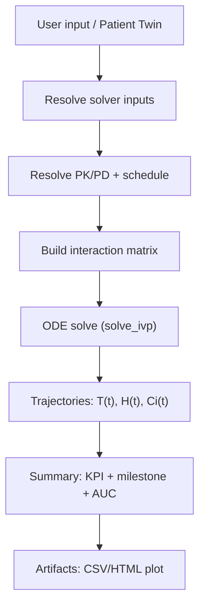
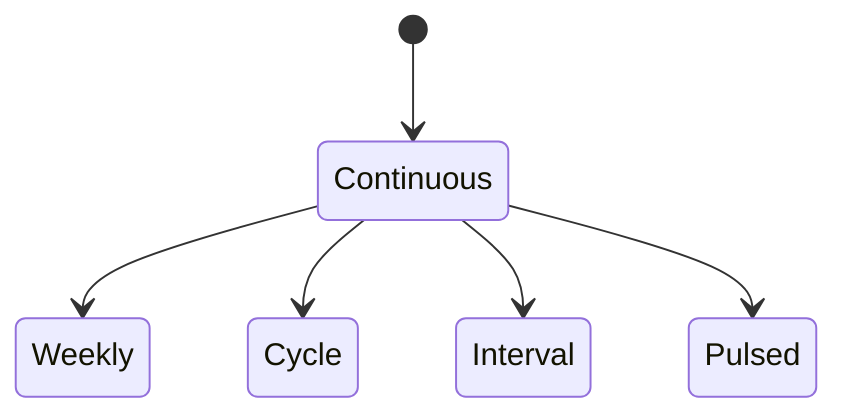

# Mathematical Models (theory + implementation)

This page documents the **mathematical models** used by the simulator and how they map to the code.

!!! warning "Important note"
    This documentation describes an **educational/research** model and its software implementation.
    It does not replace clinical judgement, guidelines, or regulatory validation.

!!! info "Where to look in code"
    - Runtime model: `simulator/models_simulation.py` (`MathematicalModel.simulate`)
    - Documented variants: `simulator/mathematical_models.py`
    - End-to-end pipeline (inputs → ODE → summary → artifacts): `simulator/models.py` (`SimulationAttempt.run_model`)
    - PK/PD presets + schedules: `simulator/pharmaco/registry.py`

## Quick find

| I want… | Go to… |
| --- | --- |
| understand KPIs (formal definitions) | section **KPI (summary)** |
| understand schedules (dosing functions) | section **Schedule** |
| understand Patient Twin parameter injection | section **Patient Twin** |
| see toy figures | `Guides → Simulations Gallery` |

## Glossary (terminology)

- **ODE (Ordinary Differential Equation)**: describes how a variable changes over time.
- **State (state vector)**: variables integrated by the solver (here: \(T, H, C_i\)).
- **Initial conditions**: values at simulation start (e.g., \(T(0)\)).
- **Parameter**: numeric value controlling system behavior (e.g., \(r_T\), \(EC50\)).
- **Units**: consistent dimensions (e.g., 1/day, days, mg/L).
- **Carrying capacity** (\(K\)): upper growth limit in logistic-like models.
- **Half-life** (\(t_{1/2}\)): time to halve concentration (PK).
- **Elimination rate** (\(k_{elim}\)): elimination constant \(k=\ln(2)/t_{1/2}\).
- **Schedule** (\(u(t)\)): dose/time input function (continuous or pulsed).
- **AUC**: area under concentration curve \(C(t)\), a proxy for total exposure.
- **KPI**: summary metrics computed from trajectories (e.g., `tumor_reduction`).

## Overview (pipeline)

## State variables

Terminology:

- \(t\): time (runtime uses **days**)
- \(T(t)\): tumor burden (cell count or scalar proxy)
- \(H(t)\): “healthy” compartment (reserve proxy)
- \(C_i(t)\): drug \(i\) concentration (internal units; consistent within the model)

Intuition:

- \(T(t)\) is “how much disease is left”
- \(H(t)\) is “how robust the healthy compartment is”
- \(C_i(t)\) depends on dosing schedule and half-life

## Equations (runtime implementation)

### Tumor growth and kill

Terminology:

- \(r_T\) (*growth rate*): how fast tumor grows when far from \(K_T\)
- \(K_T\) (*carrying capacity*): growth slows as \(T\to K_T\)
- \(\sum_i E_i(C_i)\): total drug effect strength (from PD)

The runtime model uses a **logistic** growth term:

$$
\frac{dT}{dt} = r_T \, T \left(1 - \frac{T}{K_T}\right) - \Big(\sum_i E_i(C_i)\Big)\,T
$$

Illustrative plot (logistic growth for different \(r_T\)):

### Healthy compartment and toxicity

Terminology:

- \(r_H\), \(K_H\): healthy analogs of tumor parameters
- \(I\): `immune_compromise_index` (toxicity multiplier)
- \(\overline{E(C)}\): mean drug effect (toxicity proxy)

$$
\frac{dH}{dt} = r_H \, H \left(1 - \frac{H}{K_H}\right) - I \cdot \overline{E(C)} \cdot H
$$

Illustrative plot (tumor vs healthy, with/without therapy):

### Pharmacokinetics (PK) per drug

Terminology:

- \(t_{1/2}\): half-life
- \(k_{elim}\): elimination rate
- \(u_i(t)\): dosing input rate (schedule)

$$
\frac{dC_i}{dt} = -k_{elim,i}\,C_i + u_i(t)
$$

with:

$$
k_{elim,i} = \frac{\ln 2}{t_{1/2,i}}
$$

Illustrative plot (continuous vs pulsed schedule):

## Pharmacodynamics (PD)

### Emax (base)

Terminology:

- \(E_{max}\): maximum effect (capped to 1 in runtime)
- \(EC50\): concentration yielding half-max effect
- \(C\): instantaneous concentration

$$
E_i(C_i) = E_{max,i}\,\frac{C_i}{EC50_i + C_i}
$$

Illustrative plot (Emax curves for different EC50):

### Drug–drug “interactions”

Runtime first computes a vector \(E\) and then applies a linear correction:

$$
E' = \mathrm{clip}(E + A\cdot E,\ 0,\ 1)
$$

In code, \(A\) is built as:

- `interaction_matrix = I * interaction_strength` (scaled identity)

So by default this is a per-drug amplification proportional to `interaction_strength` (not a full cross-synergy matrix).

!!! note "Difference vs `simulator/mathematical_models.py`"
    `simulator/mathematical_models.py` documents richer variants (e.g., Gompertz, Greco-like synergy).
    The current runtime simulation uses the compact model above (logistic + Emax + schedule).

## Schedule (dosing function) — theory and supported forms

Schedule enters as \(u_i(t)\) and can be:

Implementation: `simulator/pharmaco/registry.py` builds \(u(t)\) from YAML:

- `continuous`: constant input \(u(t)=\frac{Dose}{H}\)
- `weekly`: dosing on selected weekdays, for an `administration_window_days`
- `cycle`: dosing for `days_on` within a `cycle_length`
- `interval`: dosing every `interval_days`
- `pulsed`: dosing on explicit day lists

## Numerical solver

Runtime:

- integrator: `scipy.integrate.solve_ivp`
- tolerances: `rtol=1e-6`, `atol=1e-8`
- sampling: `evaluation_points=200` (uniform between 0 and `time_horizon`)

## Outputs (trajectories)

The simulator returns a table (pandas DataFrame) with columns:

- `time`
- `tumor_cells`
- `healthy_cells`
- `"{drug}_concentration"` for each drug

## KPI (summary) — formal definitions

Terminology:

- “start/baseline”: value at \(t=0\)
- “end”: value at \(t=time\_horizon\)
- many KPIs are ratios in \(0..1\)

Computed in `simulator/models.py` within `SimulationAttempt.run_model`:

### Tumor reduction

$$
\mathrm{tumor\_reduction} = 1 - \frac{T_{end}}{T_{start}}
$$

### Healthy loss

$$
\mathrm{healthy\_loss} = 1 - \frac{H_{end}}{H_{start}}
$$

### Nadir

Minimum of \(T(t)\):

- `nadir.day`: \(t\) at \(\min T(t)\)
- `nadir.tumor_cells`: \(\min T(t)\)
- `nadir.tumor_reduction`: \(1 - \frac{\min T(t)}{T_{start}}\)

### Milestones (30/60/90/end)

For \(d \in \{30,60,90,\text{end}\}\) pick the closest point and store:

- `tumor_cells`, `healthy_cells`
- `tumor_reduction` at day \(d\)
- `healthy_loss` at day \(d\)

### Durability index

Fraction of time where \(T(t) < T_{start}\):

$$
\mathrm{durability\_index} = \frac{1}{H}\int_0^{H} \mathbf{1}[T(t) < T_{start}]\,dt
$$

### Time to recurrence

First time **after nadir** when \(T(t)\) exceeds 50% of baseline:

$$
T(t) > 0.5\,T_{start}
$$

### AUC per drug

$$
\mathrm{AUC}_i = \int_0^{H} C_i(t)\,dt
$$

## Uncertainty / cohort (internal replicates)

Terminology:

- **cohort**: multiple internal replicates with perturbed parameters
- **p05/p95**: 5th/95th percentile uncertainty band
- **seed**: random seed

If `cohort_size > 1`, the system runs internal replicates without creating extra DB records:

- perturbs baseline and growth via log-normal multipliers (different sigmas for T/H)
- computes stats (mean, p05, p95) for:
  - `tumor_reduction`, `healthy_loss`, `durability_index`, `auc_total`
  - `time_to_recurrence` + `recurrence_rate`
  - milestones (30/60/90/end) for tumor reduction and healthy loss

Illustrative band plot:

## Patient Twin (how it changes parameters)

Terminology:

- **Twin payload**: dict of biologic parameters derived from labs (`Assessment`)
- **Auto**: inject only parameters left as “auto” by the user
- **Guided choices**: qualitative choices mapped to small multipliers

In `twin_biology_mode=auto`, some values may be injected if the user left them “auto”:

- `tumor_growth_rate`, `healthy_growth_rate`
- `carrying_capacity_tumor`, `carrying_capacity_healthy`
- `immune_compromise_index`

Then “guided choices” apply small multipliers:

- `guided_tumor_aggressiveness` ∈ {lower, typical, higher}
- `guided_immune_status` ∈ {better, typical, worse}

Example:

- if `tumor_growth_rate` is auto, Twin may set it based on risk/labs (e.g., 0.035 vs 0.02)
- if the user then chooses `guided_tumor_aggressiveness=higher`, runtime applies a multiplier (~1.15) to the resolved value
