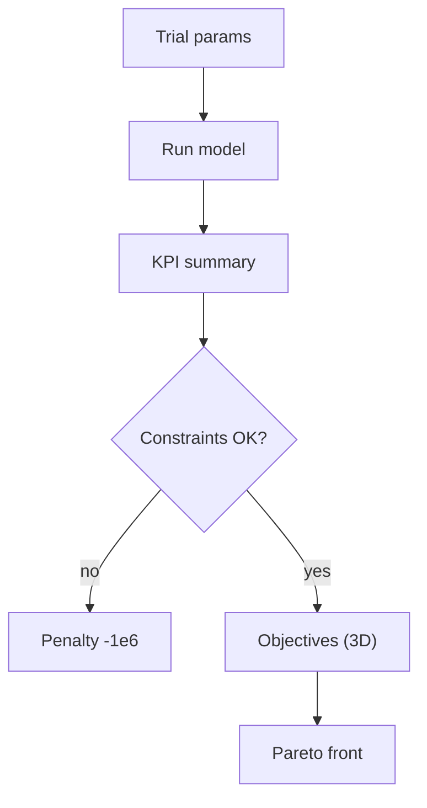
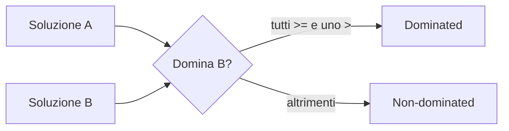

# Optimization Theory (Optimization Lab)

Questa sezione documenta **come** l’Optimization Lab costruisce e valuta le soluzioni, e cosa significano gli obiettivi (multi-obiettivo / Pareto).

## Obiettivi e vincoli

Nel codice (`simulator/objectives.py`) gli obiettivi sono:

- **Efficacy**: massimizzare `tumor_reduction`
- **Safety**: minimizzare `healthy_loss` (implementato come massimizzazione di `-healthy_loss`)
- **Exposure**: minimizzare $\sum_i \mathrm{AUC}_i$ (implementato come massimizzazione di `-sum(AUC)`).

Vincolo “hard”:

- `healthy_loss <= 0.25` (soluzione “feasible”)

## Spazio di ricerca (search space)

Definito in `simulator/search_space.py` come una griglia/insieme di range:

- `lenalidomide_dose` (float, step)
- `bortezomib_dose` (float, step)
- `daratumumab_dose` (float, step)
- `time_horizon` (int, step 28 giorni)
- `interaction_strength` (float, step 0.01)

Più alcune manopole “di schedule” (annotate come `_schedule` nei parametri), usate per report e future estensioni:

- `len_on_days`
- `bor_weekly`
- `dara_interval`

!!! note "Importante"
    La schedule “runtime” effettiva entra nel modello tramite `dose_functions` (preset YAML).  
    Queste manopole `_schedule` oggi sono soprattutto metadata per UI/report, non tutte sono necessariamente collegate a \(u(t)\).

## Algoritmo (Optuna)

`simulator/optim.py` usa Optuna con:

- sampler: `TPESampler(seed=..., multivariate=True)`
- pruner: `MedianPruner(n_startup_trials=10, ...)`
- direzioni: `maximize/maximize/maximize` (perché safety/exposure sono negate)

## Pareto front (non-dominated)

Una soluzione \(A\) domina \(B\) se:

- \(A\) è **>=** su tutti gli obiettivi
- ed è **>** su almeno uno

La UI mostra la Pareto table ordinata per:

- efficacia decrescente
- safety crescente/decrescente a seconda della metrica esposta (nel codice viene “convertita” per UI)

## Interpretazione clinica (pratica)

### Come leggere una Pareto table

- se due soluzioni hanno simile `tumor_reduction`, preferisci quella con `healthy_loss` più basso
- se un aumento marginale di efficacia “costa” molta tossicità, è spesso una zona da evitare
- l’esposizione (AUC) aiuta a distinguere regimi che “ottengono lo stesso” con meno farmaco

### Perché 3 obiettivi?

Perché in clinica di solito non esiste un singolo “best”:  
si sceglie un compromesso tra efficacia, tollerabilità e intensità complessiva.
