# Simulations & Visuals (gallery)

> **E1 research-prototype boundary:** every figure is illustrative or
> model-relative. No figure establishes clinical efficacy, safety, prognosis,
> patient benefit, or a causal treatment effect.

=== "IT"
    Questa pagina raccoglie esempi **visivi** (grafici + mappe) per capire rapidamente cosa fa il sistema.

    ## Terminologia

    - **Toy**: esempio illustrativo (non calibrato su dati reali).
    - **AUC**: area sotto curva (proxy di esposizione).
    - **p05/p95**: percentili per bande d’incertezza.

    ## Se cerchi…

    | Voglio… | Vai a… |
    | --- | --- |
    | teoria modelli | `Guides → Mathematical Models` |
    | come leggere i KPI | `Guides → Docs → Simulator KPIs (How to Read)` |
    | ottimizzazione e Pareto | `Guides → Optimization Theory` |
    | historical unvalidated transforms | `Deep Dives → Archive → Legacy Unvalidated Model Outputs` |

    !!! tip
        Clicca qualsiasi diagramma Mermaid per **zoom/pan**.

    ## 1) Crescita tumorale (logistica) — esempio

    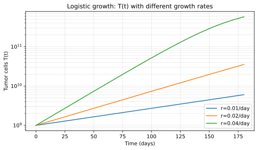

    **Cosa mostra**: al crescere di \(r_T\) il tumore cresce più rapidamente e raggiunge prima la saturazione vicino a \(K_T\).

    ## 2) PK (concentrazione) — schedule diverso, profilo diverso

    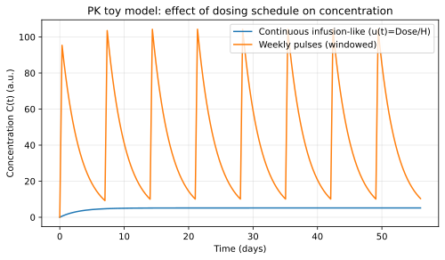

    **Cosa mostra**: una schedule pulsata genera picchi/valle; una input “continuo” è più stabile.

    ## 3) PD (Emax) — esempio di EC50

    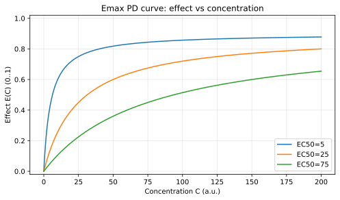

    **Cosa mostra**: a parità di \(E_{max}\), un EC50 più basso produce effetto elevato già a basse concentrazioni.

    ## 4) Dinamica accoppiata (tumore vs healthy)

    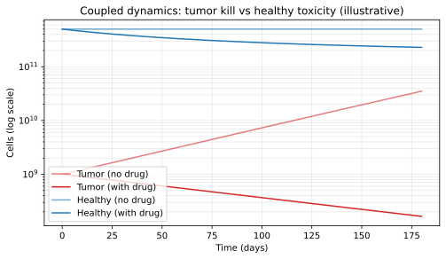

    **Cosa mostra**: l'effetto configurato del modello modifica \(T(t)\) e può
    modificare \(H(t)\); non è una previsione clinica di efficacia o tossicità.

    ## 5) Incertezza (coorte) — bande p05/p95 (toy)

    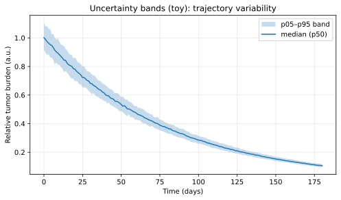

    **Cosa mostra**: con repliche (cohort_size>1) puoi ottenere una banda di variabilità (percentili).

    ## 6) Optimization Lab — Pareto front (toy)

    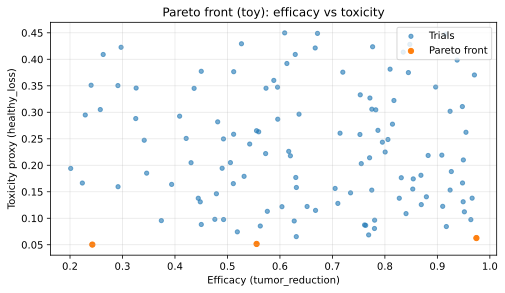

    **Cosa mostra**: soluzioni Pareto non sono dominate: per migliorare efficacia spesso “paghi” tossicità.

    ## 7) Mappe Mermaid (flussi)

    ### End-to-end (Clinica → Twin → Simulatore → KPI)

    ```mermaid
    flowchart TD
      A["Clinic: Patient + Assessment"] --> B["Twin: derive biology (optional)"]
      B --> C["Simulator: Scenario + Params"]
      C --> D["ODE solve"]
      D --> E["KPI + artifacts (CSV/Plot)"]
      E --> F["UI: charts + model-relative diagnostics"]
    ```

    ## 7b) Output simulazione — esempio reale (da test automatici)

    !!! warning "Strutture molecolari e KPI simulati"
      ChemTools espone contesto molecolare e di database. Non emette stime
      validate di efficacia, sopravvivenza, tossicità o rischio-beneficio.

    !!! tip "Farmaco non in preset (Custom drug)"
      Per simulare un agente non presente nei preset YAML (modalità sperimentale editor-only), vedi:
      `Guides → Docs → Custom drug (experimental)`.

    Questo è un esempio di **output reale** generato automaticamente (vedi script screenshots).

    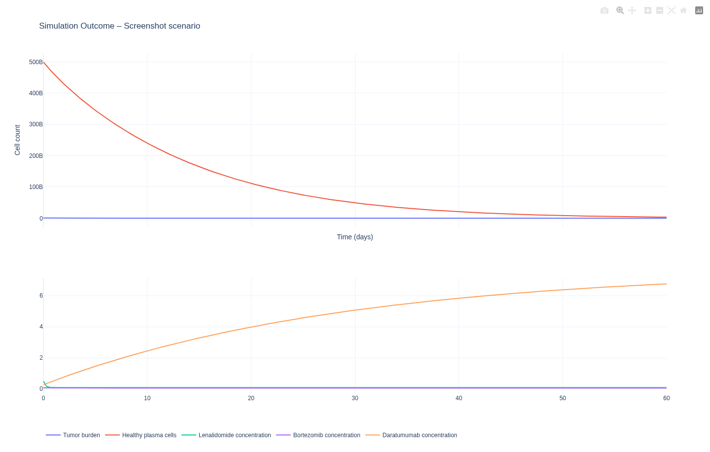

    **Artifact prodotti dal simulatore** (per ogni attempt):

    - CSV con la traiettoria (time, tumor_cells, healthy_cells, concentrazioni)
    - HTML Plotly con i grafici (visualizzabile anche via `/media/...`)

    **Sanity checks numeriche** (regressioni):

    - KPI finiti (no NaN/inf)
    - traiettorie senza NaN/inf
    - cellule non-negative
    - tempo monotono e nel range richiesto

    ## 8) Difficulty score — response/toxicity/survival (toy)

    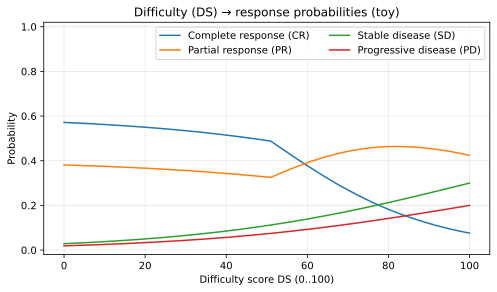

    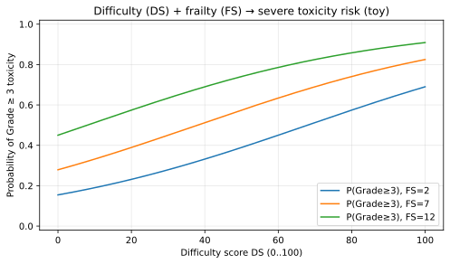

    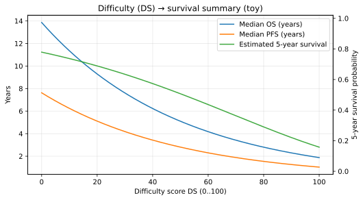

    **Cosa mostra**: trasformazioni storiche illustrative di uno score
    composito. Non sono output prognostici validati né output correnti autorizzati.

    ## 9) Prognosis — baseline OS per R-ISS (toy)

    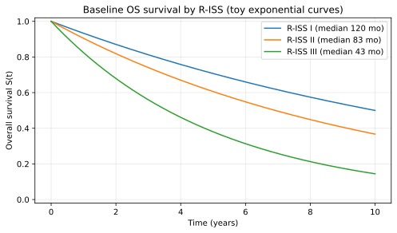

    **Cosa mostra**: curve esponenziali illustrative coerenti con mediane diverse per R-ISS.

=== "EN"
    This page is a **visual gallery** (plots + maps) to quickly understand the system.

    ## Terminology

    - **Toy**: illustrative example (not calibrated to real-world data).
    - **AUC**: area under the curve (exposure proxy).
    - **p05/p95**: percentiles for uncertainty bands.

    ## Quick find

    | I want… | Go to… |
    | --- | --- |
    | model theory | `Guides → Mathematical Models` |
    | how to read KPIs | `Guides → Docs → Simulator KPIs (How to Read)` |
    | optimization and Pareto | `Guides → Optimization Theory` |
    | historical unvalidated transforms | `Deep Dives → Archive → Legacy Unvalidated Model Outputs` |

    !!! tip
        Click any Mermaid diagram to **zoom/pan**.

    ## 1) Tumor growth (logistic) — example

    

    ## 2) PK — schedule changes the profile

    

    ## 3) PD (Emax) — EC50 intuition

    

    ## 4) Coupled dynamics (tumor vs healthy)

    

    ## 5) Uncertainty bands (toy)

    

    ## 6) Optimization Lab — Pareto front (toy)

    

    ## 7) Mermaid maps

    ```mermaid
    flowchart TD
      A["Clinic: Patient + Assessment"] --> B["Twin: derive biology (optional)"]
      B --> C["Simulator: Scenario + Params"]
      C --> D["ODE solve"]
      D --> E["KPIs + artifacts (CSV/Plot)"]
      E --> F["UI: charts + model-relative diagnostics"]
    ```

    ## 7b) Simulation output — real example (from automated tests)

    !!! warning "Molecular structures and simulated KPIs"
      ChemTools exposes molecular and database context. It does not emit
      validated efficacy, survival, toxicity, or risk-benefit estimates.

    !!! tip "Non-preset agent (Custom drug)"
      To simulate an agent not present in YAML presets (experimental editor-only mode), see:
      `Guides → Docs → Custom drug (experimental)`.

    This is a **real output** example generated automatically (see screenshots script).

    

    **Artifacts produced** (per attempt):

    - CSV trajectory (time, tumor_cells, healthy_cells, concentrations)
    - Plotly HTML (also viewable via `/media/...`)

    **Numerical sanity checks** (regression guards):

    - finite KPIs (no NaN/inf)
    - trajectories with no NaN/inf
    - non-negative cell counts
    - monotonic time within requested horizon

    ## 8) Difficulty score — response/toxicity/survival (toy)

    

    

    

    These plots preserve historical illustrative transforms. They are not
    validated prognosis outputs or authorized current prediction interfaces.

    ## 9) Prognosis — baseline OS by R-ISS (toy)

    
