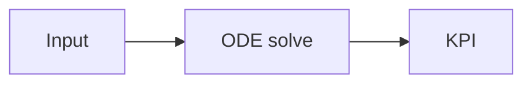

# bmyCure4MM — Documentazione

Questa documentazione è pensata per:

- **Clinici** (workflow, concetti, “perché”)
- **Sviluppatori** (come è fatta, API, DB, deployment)
- **Ricercatori** (simulatore, PK/PD, chemtools)

!!! tip "Scelta rapida"
    - Vai alla guida **Architettura**: `Guides → Architecture`
    - Vai alla guida **Database**: `Guides → Database`
    - Setup dev: `Guides → Development`

## Struttura del sito

- **Start Here**: tutorial “primo avvio” (EN/IT)
- **Guides**: architettura, DB, operazioni, sviluppo
- **Reference**: configurazione, script, app (Clinic/Simulator/ChemTools/Docs Viewer)
- **Deep Dives**: documenti tecnici già presenti nel repo (modelli, testing, architetture dati)

## Notazione usata

!!! info "Convezioni"
    - `path/` indica cartella, `file.py` indica file.
    - `ENV_VAR` indica variabile d’ambiente.
    - I diagrammi sono in **Mermaid** (render in MkDocs Material).

## Verifica rendering (Mermaid + formule)

Se qui sotto non vedi un diagramma e una formula, stai probabilmente guardando i `.md` “raw” (es. preview editor/GitHub) e non il sito MkDocs.

Avvia così:

```bash
./venv/bin/pip install -r requirements-docs.txt
./venv/bin/mkdocs serve
```

Diagramma:



Formula:

$$
\mathrm{tumor\_reduction} = 1 - \frac{T_{end}}{T_{start}}
$$
