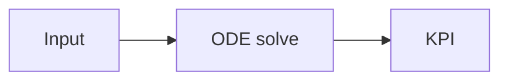
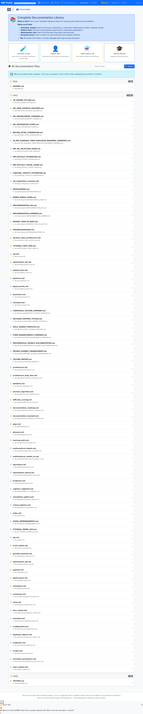
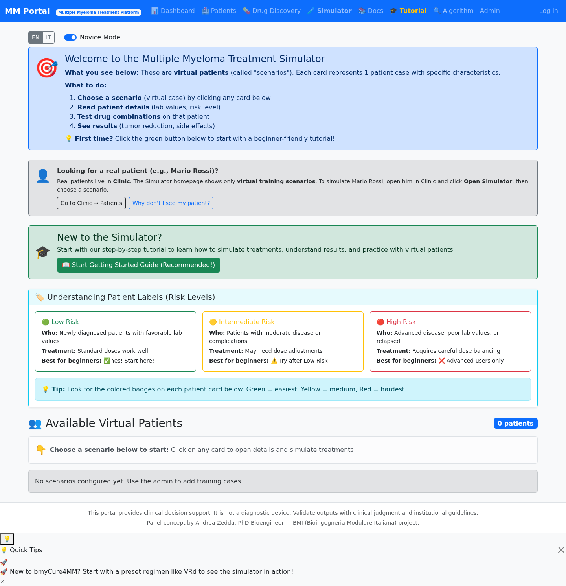
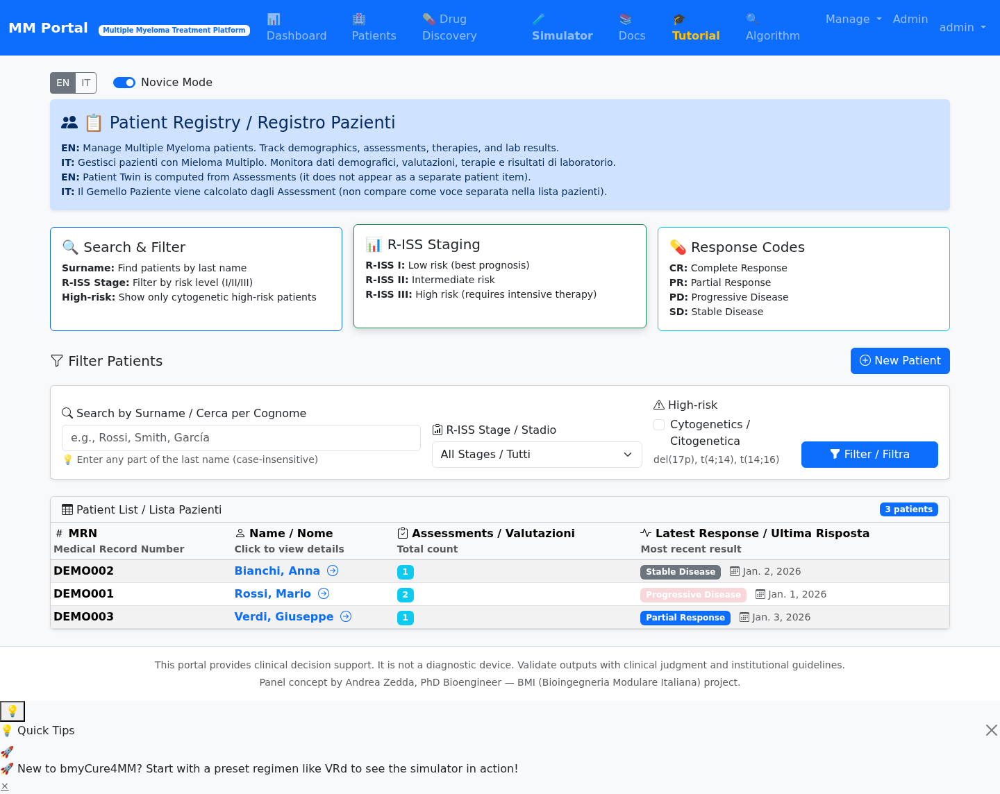
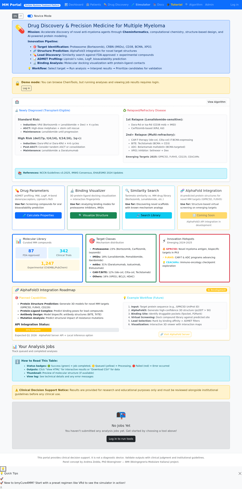
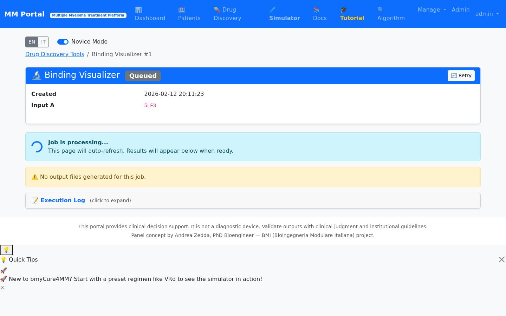

# bmyCure4MM — Documentazione

Questa documentazione è pensata per:

- **Clinici** (workflow, concetti, “perché”)
- **Sviluppatori** (come è fatta, API, DB, deployment)
- **Ricercatori** (simulatore, PK/PD, chemtools)

!!! tip "Scelta rapida"
    - Vai alla guida **Architettura**: `Guides → Architecture`
    - Vai alla guida **Database**: `Guides → Database`
    - Mappa oggetti DB: `Reference → Database Objects`
    - Setup dev: `Guides → Development`
    - Percorso guidato: `Learning Path`

!!! info "Percorsi (cosa / dove / perché)"
  - **Clinico** (Twin + KPI): [Gemello Paziente (IT)](it/gemello_paziente.md) → [Simulatore (IT)](it/simulatore.md)
  - **Ricercatore** (molecole/evidence): [ChemTools (Reference)](reference/apps/chemtools.md) → [Bridge Molecule→Simulation](guides/molecule_to_simulation_bridge.md)
  - **Sperimentale** (farmaco non in preset): [Custom drug (experimental)](guides/custom_drug_experimental.md)
  - **DevOps/Deploy**: [Operations](guides/operations.md) → [Configuration](reference/configuration.md)

## Struttura del sito

- **Start Here**: tutorial “primo avvio” (EN/IT)
- **Guides**: architettura, DB, operazioni, sviluppo
- **Reference**: configurazione, script, app (Clinic/Simulator/ChemTools/Docs Viewer)
- **Deep Dives**: documenti tecnici già presenti nel repo (modelli, testing, architetture dati)

## Notazione usata

!!! info "Convezioni"
    - `path/` indica cartella, `file.py` indica file.
    - `ENV_VAR` indica variabile d’ambiente.
    - I diagrammi sono in **Mermaid** (render in MkDocs Material).

## Verifica rendering (Mermaid + formule)

Se qui sotto non vedi un diagramma e una formula, stai probabilmente guardando i `.md` “raw” (es. preview editor/GitHub) e non il sito MkDocs.

Avvia così:

```bash
./venv/bin/pip install -r requirements-docs.txt
./venv/bin/mkdocs serve
```

Diagramma:



Formula:

$$
\mathrm{tumor\_reduction} = 1 - \frac{T_{end}}{T_{start}}
$$

## Demo pubblica: percorsi rapidi (con screenshot)

=== "IT"
  Questi sono **3 “test di utilizzo”** sintetizzati come percorsi realistici, pensati per chi visita il demo pubblico su **bmycure4mm**.

  !!! note "Nota su login e dati"
    Il demo pubblico è pensato per consultazione/lettura. Le schermate “cliniche” qui sotto sono prese da un ambiente demo con dati di esempio.

  ### 1) Curioso (first contact)
  - Apro il sito e capisco “cosa fa” senza login.
  - Vado su **Docs** e cerco una keyword (es. "twin", "R-ISS", "toxicity").
  - Leggo il tutorial “primo run” e mi faccio un’idea del flusso.

  

  ### 2) Ricercatore (modelli e simulazioni)
  - Apro **Simulator** e sfoglio gli scenari disponibili.
  - Entro in uno scenario e verifico: orizzonte, coorte, parametri Twin.
  - Confronto regimi diversi e leggo le metriche (tumor reduction / healthy loss).

  

  ### 3) Medico (workflow clinico: pazienti → assessment → suggerimenti)
  - Accedo in ambiente demo (se disponibile).
  - Vado su **Pazienti**, apro una scheda e controllo gli assessment (snapshot lab).
  - Uso la pagina per ragionare su trade-off efficacia/tossicità e su suggerimenti di regime.

  

  ### 4) Ricercatore (molecole e struttura — ChemTools)
  - Apro **Drug Discovery (ChemTools)**.
  - Uso **Binding visualization** (PDB + ligando) e/o **Similarity search** (SMILES).
  - Leggo la pagina Job (viewer + sezioni evidence-based).

  

  

  !!! tip "Come vengono prodotti gli screenshot"
    Gli screenshot sono generati con uno script automatico basato su Playwright.
    Vedi: `docs/assets/scripts/generate_ui_screenshots.py`.

=== "EN"
  Three compact “usage tests” written as realistic user journeys for the public demo.

  1) **Curious visitor**: read docs without login.
  2) **Researcher**: browse scenarios and modeling docs.
  3) **Clinician**: patient/assessment workflow (demo environment).

