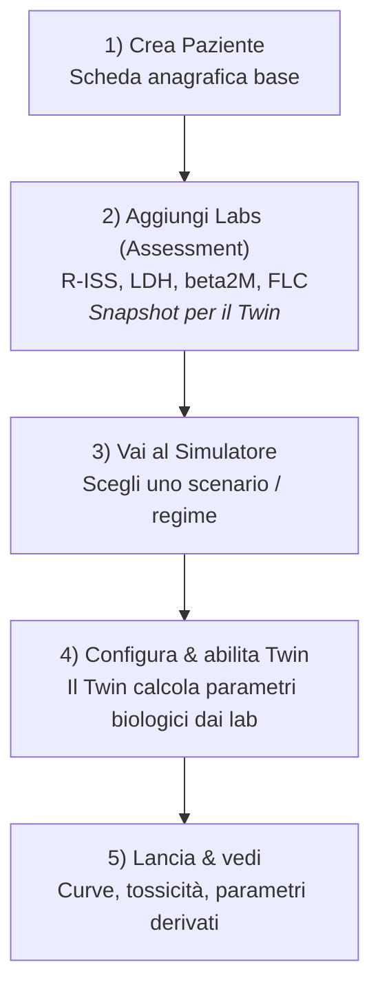

# Tutorial: Prima Simulazione Completa (da Zero a Risultato)

**Obiettivo:** Simulare l'effetto di un regime terapeutico su un paziente con Mieloma Multiplo, vedere le curve tumorali e l'impatto sul paziente.

---

## Il Flusso Completo (5 passi)



---

## PASSO 1: Crea un Paziente

1. **Vai su:** `http://127.0.0.1:8000/patients/` (oppure clicca **Clinica** → **Pazienti**)
2. **Clicca:** bottone verde **"+ New Patient"** in alto
3. **Compila i campi minimi:**
   - Nome: `Mario`
   - Cognome: `Rossi`
   - Data di nascita: `1960-01-15`
   - Sesso: `M`
4. **Salva**

✅ Hai creato il paziente. Ora serve uno "snapshot" dei suoi esami del sangue.

---

## PASSO 2: Aggiungi un Assessment (Laboratorio)

Un **Assessment** = uno snapshot di laboratorio/clinica **in una data precisa**.

1. **Dopo aver salvato il paziente**, ti trovi nella pagina dettaglio paziente
2. **Cerca la sezione "Assessments"** (sotto i dati anagrafici)
3. **Clicca:** bottone **"Add Assessment"**
4. **Compila i campi lab (esempio paziente ad alto rischio):**
   - **Data:** oggi (es. `2026-01-05`)
   - **R-ISS Stage:** `III` (alto rischio)
   - **LDH (U/L):** `600` (molto alto, normale è <280)
   - **Beta-2 Microglobulin (mg/L):** `12.0` (alto, normale <3.5)
   - **FLC Ratio (κ/λ):** `8.5` (molto sbilanciato, normale ~1.0)
   - **M-protein (g/dL):** `4.5` (opzionale)
   - **Response:** lascia vuoto o `PD` (progressive disease)
5. **Salva**

✅ Hai creato lo snapshot lab. Ora il **Patient Twin** può calcolare i parametri biologici da questi valori.

---

## PASSO 3: Vai al Simulatore

1. **Torna alla home** (clicca logo in alto o `/`)
2. **Clicca:** sezione **"Simulator"** → **"Browse Scenarios"**
3. **Scegli uno scenario** (es. scenario ID `2` - tipicamente è un regime triplet VRd: Bortezomib + Lenalidomide + Dexamethasone)
4. **Clicca sul titolo dello scenario** per aprire la pagina dettaglio

Ora vedrai il pannello con il form di simulazione.

---

## PASSO 4: Configura la Simulazione & Abilita il Twin

### 4.1 Scegli un Preset (opzionale ma consigliato)

- Nel campo **"Preset"**, seleziona `standard_triplet` o simile
- Questo popola dosi "sicure" automaticamente

### 4.2 Abilita il Patient Twin

1. **Scorri giù** fino alla sezione **"4. Advanced & Twin / Avanzate & Gemello"**
2. **Attiva lo switch** "Use Patient Twin (Usa Gemello Paziente)"
3. **Seleziona l'Assessment:**
   - Nel dropdown **"Twin Assessment"** vedrai l'assessment che hai appena creato
   - Seleziona quello con la data di oggi (es. `Mario Rossi - 2026-01-05`)
4. **Scegli la modalità:**
   - **Twin Biology Mode:** seleziona **"Auto"**
   - Questo fa sì che il Twin calcoli `tumor_growth_rate`, `carrying_capacity_tumor`, ecc. automaticamente dai lab

### 4.3 Imposta Orizzonte e Coorte (opzionali)

- **Time Horizon (days):** `180` (6 mesi di simulazione)
- **Cohort Size:** `1` (per ora tieni basso per velocità; poi puoi provare 10 o 50 per vedere bande di incertezza)

### 4.4 (Opzionale) Controlla le Dosi

Se hai scelto un preset, le dosi sono già popolate. Altrimenti:
- **Lenalidomide:** 25 mg
- **Bortezomib:** 1.3 mg/m²
- **Daratumumab:** 16 mg/kg

---

## PASSO 5: Lancia la Simulazione e Vedi i Risultati

1. **Clicca:** bottone blu **"Run Simulation"** in basso
2. **Aspetta** 10-30 secondi (vedrai un indicatore di caricamento)
3. **Risultati comparsi sotto il form:**

### Cosa vedrai:

#### A) **Grafico Temporale (Plot Interattivo)**
   - **Asse X:** giorni (0 → 180)
   - **Asse Y:** cellule
   - **Curva rossa:** cellule tumorali (deve scendere!)
   - **Curva verde:** cellule sane (cerca di mantenerla alta)
   - Se hai messo cohort size > 1, vedrai bande di variabilità

#### B) **KPI (Key Performance Indicators)**
   - **Tumor Reduction (%):** es. `92.5%` → ottima risposta!
   - **Healthy Loss (%):** es. `15.2%` → tossicità gestibile
   - **Time to Recurrence (days):** es. `210` → tempo prima che il tumore ricresca
   - **AUC (Area Under Curve):** esposizione farmacologica totale

#### C) **File Scaricabili (in fondo ai risultati)**
   - **`twin_params.json`** ← Parametri derivati dal Twin (risk_score, tumor_growth_rate, ecc.)
   - **`simulation_data.csv`** ← Dati grezzi giorno per giorno
   - **`plot.html`** ← Grafico interattivo standalone

#### D) **Cosa Guardare nel `twin_params.json`**

Scarica il file e aprilo con un editor di testo. Vedrai qualcosa tipo:

```json
{
  "risk_score": 0.82,
  "tumor_growth_rate": 0.0356,
  "healthy_growth_rate": 0.0136,
  "carrying_capacity_tumor": 2100000000.0,
  "carrying_capacity_healthy": 280000000000.0,
  "immune_compromise_index": 1.215,
  "assessment_id": 3
}
```

**Interpretazione:**
- `risk_score: 0.82` → paziente ad alto rischio (da R-ISS=III, LDH alto, β2M alto)
- `tumor_growth_rate: 0.0356` → tumore cresce velocemente (vicino al max 0.04)
- `healthy_growth_rate: 0.0136` → recupero cellule sane è lento (vicino al min)
- Questi valori sono stati **calcolati automaticamente** dai lab che hai inserito nell'Assessment

---

## FAQ Rapide

### Q: Il dropdown "Twin Assessment" è vuoto, perché?

**A:** Due motivi possibili:
1. **Non hai creato un Assessment** → torna al PASSO 2
2. **Permessi:** se non sei staff/editor, vedi solo Assessment di pazienti con `owner = il tuo utente`. Soluzione rapida per test: accedi come admin/staff.

### Q: Cosa succede se NON abilito il Twin?

**A:** La simulazione usa valori biologici di default (fissi, non personalizzati sui lab del paziente). Funziona lo stesso, ma non è "patient-specific".

### Q: Come faccio a vedere l'effetto di dosi diverse?

**A:** 
1. Modifica i campi dose (es. riduci Lenalidomide da 25 a 15 mg)
2. Lancia di nuovo la simulazione
3. Confronta i KPI: tumor reduction più basso? healthy loss più basso? Trade-off efficacia/tossicità.

### Q: Posso simulare più pazienti contemporaneamente?

**A:** Aumenta il **Cohort Size** (es. 50). Vedrai bande di variabilità nel grafico. Ma ogni run usa **uno stesso** paziente (stesso Twin/Assessment): la variabilità rappresenta incertezza stocastica del modello, non pazienti diversi.

### Q: Dove trovo la spiegazione scientifica del Twin?

**A:** File dettagliato: `docs/development/PATIENT_TWIN_AS_BUILT.md`

---

## Prossimi Passi (Dopo il Primo Test)

1. **Prova pazienti con diverso rischio:**
   - Crea un secondo Assessment con R-ISS=I, LDH=200, β2M=2.5 → vedrai `risk_score` molto più basso e parametri biologici diversi
2. **Confronta regimi diversi:**
   - Scenario A: triplet VRd
   - Scenario B: doublet Rd (senza Bortezomib)
   - Quale dà miglior tumor reduction? Quale meno tossicità?
3. **Ottimizza dosi:** usa il bottone "Optimize Regimen" (se sei editor) per far trovare al sistema le dosi ottimali

---

## Glossario Ultra-Rapido

| Termine | Cosa Significa |
|---------|----------------|
| **Assessment** | Snapshot lab/clinico (R-ISS, LDH, ecc.) in una data precisa |
| **Patient Twin** | Calcolo che trasforma l'Assessment in parametri biologici (growth rate, ecc.) |
| **Scenario** | Un "caso clinico" con un regime farmacologico associato |
| **Preset** | Set di dosi pre-configurate per un regime standard |
| **Cohort Size** | Numero di "repliche" della simulazione per stimare variabilità |
| **Time Horizon** | Durata della simulazione in giorni |
| **Auto (Twin Mode)** | Il Twin **sovrascrive** i parametri biologici base con quelli derivati dai lab |
| **Manual (Twin Mode)** | Il Twin **non** sovrascrive; usi i valori che inserisci manualmente |

---

## Risoluzione Problemi Comuni

### Errore: "You have 1 unapplied migration(s)"

**Fix:**
```bash
python manage.py migrate
```

### Errore: "no such column: clinic_patient.owner_id"

**Fix:** hai fatto merge senza fare migrate. Run:
```bash
python manage.py migrate
```

### Il form non si vede / layout rotto

**Fix:** controlla che Django stia servendo gli static files:
```bash
python manage.py collectstatic --noinput
```

### Non vedo nessun Assessment nel dropdown

**Cause possibili:**
1. Non ne hai creato → vedi PASSO 2
2. Il paziente ha `owner != tuo_utente` e tu non sei staff → accedi come admin o assegna owner
3. Refresh la pagina (Cmd+R o Ctrl+R)

---

**Fine del Tutorial!** 🎉

Domande? Controlla il file `PATIENT_TWIN_AS_BUILT.md` per dettagli tecnici o apri un issue su GitHub.
