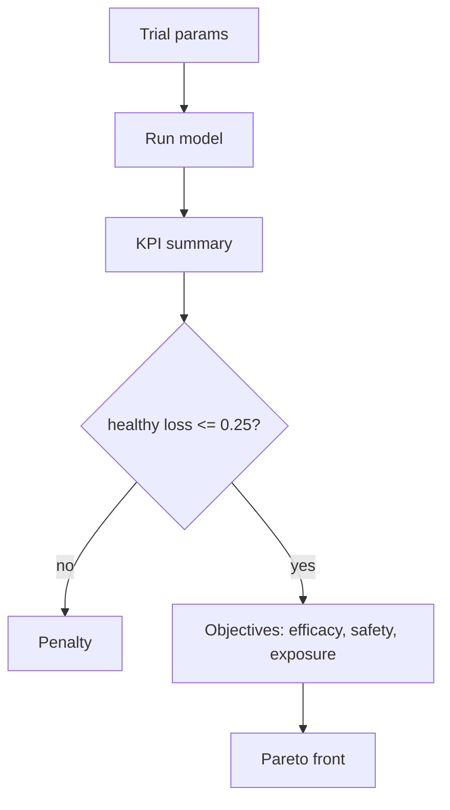

# Optimization Lab

## Obiettivi
- Massimizzare la **riduzione tumorale**
- Minimizzare la **perdita sani** (vincolo ≤ 0.25)
- Minimizzare l'**esposizione totale** (somma AUC)

## Algoritmo
- MOTPE (Optuna) con numero di trial configurabile e seed.
- Penalità per violazioni di tossicità o schedule.
- Pareto ordinato per efficacia decrescente.

## Diagramma (Mermaid)

Approfondimento teorico (multi-obiettivo, Pareto, search space): `Guides → Optimization Theory`.

## Riproducibilità
- Imposta il seed nel form per replicare i trial.
- Esporta i risultati (JSON) per archiviazione.

## Tutorial
1. Scenario R-ISS III con Gemello attivo.
2. Avvia 50 trial, seed 2025.
3. Seleziona tre soluzioni Pareto e clicca “Simula”.
4. Confronta KPI con la run iniziale e conserva gli artifact.
