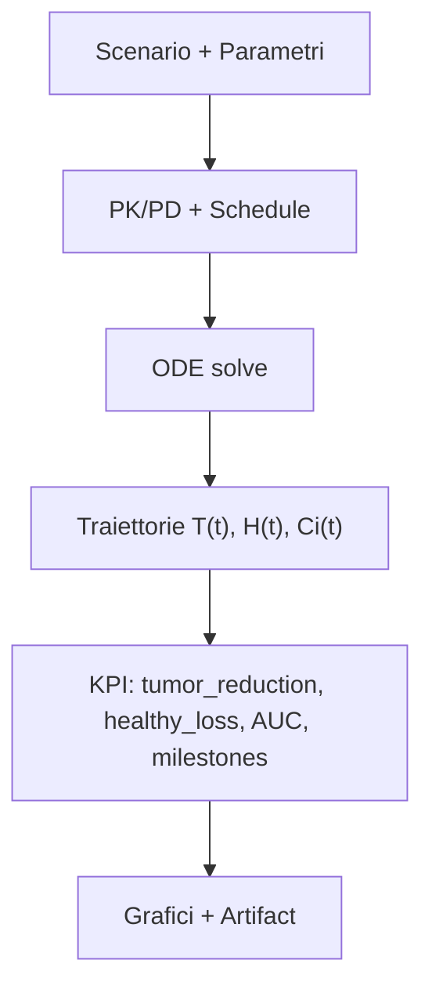

# Guida al Simulatore - Spiegazione Completa

## 🎯 Cosa fa il Simulatore?

Il simulatore è come un **laboratorio virtuale** dove puoi testare trattamenti per il Mieloma Multiplo senza rischi. È come giocare a un videogioco, ma basato su scienza vera!

### Per chi è?
- ✅ **Medici** che vogliono testare strategie terapeutiche
- ✅ **Ricercatori** che studiano nuove combinazioni farmaci
- ✅ **Studenti** che stanno imparando oncologia
- ✅ **Chiunque** voglia capire come funzionano i trattamenti

### Cosa puoi fare?
1. **Simulare** → Vedere come un paziente virtuale risponde ai farmaci
2. **Ottimizzare** → Trovare la dose perfetta per massimo beneficio/minimo danno
3. **Confrontare** → Testare diverse combinazioni e scegliere la migliore
4. **Imparare** → Capire i modelli matematici dietro i trattamenti

---

## 📚 Concetti Base Spiegati Semplicemente

### Cos'è il Mieloma Multiplo?
È un tumore del sangue dove alcune cellule (plasmacellule) nel midollo osseo crescono troppo e in modo sbagliato.

### Come funzionano i farmaci?
I farmaci anti-mieloma attaccano le cellule tumorali in 3 modi:
1. **Lenalidomide** → Sveglia il sistema immunitario per attaccare il tumore
2. **Bortezomib** → Blocca le "pompe di rifiuti" delle cellule tumorali, facendole morire
3. **Daratumumab** → Anticorpo che si attacca alle cellule tumorali e le marca per la distruzione

### Cosa sono i "modelli matematici"?
Immagina una **previsione meteo**, ma per la tua salute:
- Il meteo usa equazioni per predire pioggia
- Noi usiamo equazioni per predire come le cellule rispondono ai farmaci

Le nostre equazioni considerano:
- **Crescita cellule** → Quanto velocemente si moltiplicano
- **Morte cellule** → Quante muoiono per i farmaci
- **Competizione** → Cellule sane vs cellule tumorali
- **Farmaci nel corpo** → Come vengono assorbiti, distribuiti, eliminati

---

## 🧠 “Sotto il cofano”: modello e grafi (Mermaid)

### Pipeline di simulazione (input → ODE → KPI)



### Equazioni chiave (versione “umana”)

Il modello implementato usa una crescita logistica con kill dipendente dall’effetto PD:

$$
\frac{dT}{dt} = r_T T \left(1-\frac{T}{K_T}\right) - \left(\sum_i E_i(C_i)\right)T
$$

$$
\frac{dC_i}{dt} = -k_{elim,i}C_i + u_i(t)
$$

Approfondimento completo (teoria + implementazione + KPI): `Guides → Mathematical Models`.

---

## 🚀 Come Usare il Simulatore - Passo dopo Passo

### Passo 1: Scegli uno Scenario (Paziente)
Vai su **Simulator** → Vedi la lista di pazienti virtuali.

**Cosa significano le etichette?**
- 🟢 **Low Risk** = Malattia agli inizi, più facile da trattare
- 🟡 **Intermediate Risk** = Malattia moderata
- 🔴 **High Risk** = Malattia avanzata, più difficile

**Per principianti:** Inizia con Low Risk!

### Passo 2: Controlla i Valori del Laboratorio
Quando apri uno scenario, vedi una tabella con valori come:

| Valore | Cosa Significa | Normale |
|--------|---------------|---------|
| **ANC** (Neutrofili) | Globuli bianchi che difendono da infezioni | >1.5 |
| **Piastrine** | Cellule che fermano sanguinamento | >75 |
| **Creatinina Clearance** | Quanto bene funzionano i reni | >60 ml/min |
| **LDH** | Enzima che aumenta se c'è danno | <250 U/L |

🚨 **IMPORTANTE:** Se questi valori sono fuori range, il sistema **blocca** la simulazione per sicurezza!

### Passo 3: Scegli i Farmaci e le Dosi

#### Lenalidomide (Pastiglia)
- **Dose normale:** 25 mg al giorno
- **Se reni funzionano male:** Riduci a 10-15 mg
- **Come funziona:** Si prende tutti i giorni per 3 settimane, poi 1 settimana di pausa

**Esempio pratico:**
```
Paziente normale: 25 mg/giorno
Paziente con problemi renali: 10 mg/giorno
```

#### Bortezomib (Iniezione)
- **Dose normale:** 1.3 mg/m² (per metro quadro di superficie corporea)
- **Se neuropatia (formicolio):** Riduci a 1.0 mg/m²
- **Come funziona:** Si inietta 2 volte a settimana

**Esempio pratico:**
```
Paziente senza problemi: 1.3 mg/m²
Paziente con formicolio mani/piedi: 1.0 mg/m²
```

#### Daratumumab (Infusione)
- **Dose normale:** 16 mg/kg (per kilogrammo di peso)
- **Come funziona:** Infusione endovenosa 1 volta a settimana

**Esempio pratico:**
```
Paziente 70 kg: 16 × 70 = 1120 mg totali
```

### Passo 4: Controlla i Badge di Sicurezza

Quando inserisci le dosi, vedrai badge colorati:

🟢 **Verde "Safe"** → Dose perfetta, vai tranquillo!
🟡 **Giallo "Borderline"** → Dose al limite, attenzione agli effetti collaterali
🔴 **Rosso "Unsafe"** → Dose troppo alta, sistema ti blocca!

### Passo 5: Scegli Durata e Pazienti Virtuali

**Time Horizon (Orizzonte Temporale)**
- Quanto a lungo simulare il trattamento
- **Consigliato:** 90-180 giorni (3-6 mesi)
- **Massimo:** 365 giorni (1 anno)

**Cohort Size (Numero Pazienti Virtuali)**
- Quanti pazienti virtuali testare insieme
- **Consigliato:** 100 pazienti (risultati più affidabili)
- **Veloce:** 30 pazienti (per test rapidi)

**Perché usare più pazienti?**
Come fare una media a scuola: se fai 1 compito puoi prendere 10 o 4 per caso,
ma se fai 10 compiti la media ti dice il tuo vero livello!

### Passo 6: Clicca "Run Simulation"

Il sistema ora:
1. ⚙️ **Calcola** come i farmaci entrano nel corpo (farmacocinetica)
2. 🎯 **Simula** effetti su cellule tumorali e sane (farmacodinamica)
3. 📈 **Predice** risultati nel tempo
4. 📊 **Mostra** grafici e numeri

**Tempo di attesa:** 5-30 secondi (dipende da quanti pazienti virtuali)

---

## 📊 Capire i Risultati

### Grafici Principali

#### 1. Grafico "Cellule nel Tempo"
Mostra 2 linee:
- 🔴 **Linea rossa** = Cellule tumorali (vogliamo che scenda!)
- 🔵 **Linea blu** = Cellule sane (vogliamo che resti alta!)

**Buon risultato:**
- Rossa va giù molto (tumore si riduce)
- Blu scende poco (pochi effetti collaterali)

**Cattivo risultato:**
- Rossa non scende abbastanza (tumore resiste)
- Blu scende troppo (troppi effetti collaterali)

#### 2. Grafico "Concentrazione Farmaci"
Mostra quanto farmaco c'è nel sangue nel tempo.

**Cosa vedere:**
- **Picchi alti** = Dose efficace
- **Valli troppo basse** = Farmaco finito, tumore può ricrescere

### Numeri Chiave (KPI)

#### Tumor Reduction (Riduzione Tumore)
**Cosa misura:** Quanto è diminuito il tumore rispetto all'inizio
**Come leggerlo:**
- **>80%** = 🎉 Eccellente! Tumore ridotto molto
- **50-80%** = 👍 Buono, tumore sotto controllo
- **<50%** = ⚠️ Non sufficiente, considerare cambio terapia

**Esempio pratico:**
```
Inizio: 1.000.000 cellule tumorali
Fine: 200.000 cellule tumorali
Riduzione = (1M - 200k) / 1M = 80% ✅
```

#### Healthy Loss (Perdita Cellule Sane)
**Cosa misura:** Quante cellule sane sono state danneggiate (effetti collaterali)
**Come leggerlo:**
- **<15%** = 🎉 Ottimo! Pochi effetti collaterali
- **15-25%** = ⚠️ Accettabile, monitorare paziente
- **>25%** = 🚨 Troppo tossico! Ridurre dosi

**Esempio pratico:**
```
Inizio: 5.000.000 cellule sane
Fine: 4.250.000 cellule sane
Perdita = (5M - 4.25M) / 5M = 15% ✅
```

#### AUC (Area Under Curve)
**Cosa misura:** Esposizione totale al farmaco
**Come leggerlo:**
- **Valore alto** = Tanto farmaco nel corpo (più efficace ma più tossico)
- **Valore basso** = Poco farmaco (meno tossico ma meno efficace)

**Esempio pratico:**
Immagina di riempire una piscina:
- AUC = quanta acqua (farmaco) hai messo in totale
- Se metti troppa acqua (AUC alto) → trabocca (tossicità)
- Se metti poca acqua (AUC basso) → non riempi (inefficace)

#### Time to Recurrence (Tempo alla Recidiva)
**Cosa misura:** Dopo quanto tempo il tumore può tornare
**Come leggerlo:**
- **>180 giorni** = 🎉 Ottimo! Lunga remissione
- **90-180 giorni** = 👍 Buono
- **<90 giorni** = ⚠️ Ricaduta veloce, serve terapia più aggressiva

---

## � Assistente Decisionale AI

### Cos'è?

Dopo ogni simulazione, un **assistente intelligente** analizza automaticamente i risultati e fornisce:

- 📊 **Interpretazione Automatica**: Il risultato è buono, da monitorare o sfavorevole?
- 🎯 **Raccomandazioni Prioritarie**: Quali azioni specifiche intraprendere (es. "Riduci dosi del 20%")
- 🔧 **Implementazione con Un Click**: Pulsanti diretti per modificare lo scenario e ri-eseguire
- 📈 **6 Scenari Intelligenti**: Rilevamento automatico di pattern (tossicità, scarsa efficacia, recidiva precoce, ecc.)

### Come Usarlo

**Passo 1: Esegui Simulazione**
- Completa una simulazione come al solito (vedi sopra)
- Torna alla pagina paziente dopo il completamento

**Passo 2: Controlla Valutazione Rapida**
In cima ai risultati, vedrai un banner colorato:
- 🟢 **Verde**: "Bilanciamento favorevole — efficacia e tossicità equilibrate"
- 🟡 **Giallo**: "Segnale misto — rivedi raccomandazioni sotto"  
- 🔴 **Rosso**: "Segnale sfavorevole — vedi piano d'azione sotto"

**Passo 3: Rivedi Raccomandazioni**
Se rilevati avvisi, un accordion si apre automaticamente mostrando:
- Raccomandazioni ordinate per priorità (🚨 Critica, ⚠️ Alta, ⚙️ Media, ✅ Bassa)
- Guida numerica specifica (es. "Riduci dosi del 20-30%")
- Razionale chiaro (perché questa azione è raccomandata)

**Passo 4: Implementa con Un Click**
- Ogni raccomandazione ha un pulsante **"🔧 Vai allo Scenario e Implementa"**
- Cliccalo per saltare direttamente all'editor dello scenario
- Aggiusta dosi/orizzonte come suggerito
- Ri-esegui la simulazione per vedere risultati migliorati

### 6 Scenari Automatici Rilevati

#### 1. Alta Tossicità (≥30% perdita cellule sane)
```
🚨 Priorità: CRITICA/ALTA
Azione: "Riduci dosi farmaci del 20-30% o accorcia orizzonte temporale"
Perché: Troppo danno alle cellule sane. Dosi più basse preservano funzione immunitaria.
```

#### 2. Tossicità Moderata (20-30% perdita cellule sane)
```
⚠️ Priorità: MEDIA
Azione: "Considera riduzione dosi del 10-15% se paziente mostra segni clinici"
Perché: Tossicità borderline. Monitora attentamente e riduci se compaiono effetti collaterali.
```

#### 3. Scarsa Efficacia (<30% riduzione tumore)
```
📈 Priorità: ALTA
Azione: "Aumenta dosi farmaci del 15-25% o estendi orizzonte a 224-280 giorni"
Perché: Terapia più aggressiva può migliorare risposta se tossicità accettabile.
```

#### 4. Crescita Tumore (riduzione negativa)
```
🚨 Priorità: CRITICA
Azione: "Passa a un regime diverso o aumenta significativamente le dosi"
Perché: Regime attuale inefficace. Considera combinazioni farmaci alternative.
```

#### 5. Recidiva Precoce (<90 giorni)
```
⏱️ Priorità: MEDIA
Azione: "Estendi orizzonte temporale a 224-280 giorni per simulare trattamento più lungo"
Perché: Durata terapia più lunga può ritardare recidiva e migliorare durabilità.
```

#### 6. Bilanciamento Favorevole
```
✅ Priorità: BASSA
Azione: "Ottimizza testando variazioni dosi ±10% o confronta regimi alternativi"
Perché: Impostazioni attuali promettenti. Aggiustamenti minori possono ottimizzare ulteriormente.
```

### Guida all'Implementazione

L'accordion include una guida in 4 passi:

1. **Rivedi Raccomandazione**: Leggi attentamente problema e azione suggerita
2. **Clicca Pulsante Implementazione**: Apre scenario direttamente con parametri attuali
3. **Aggiusta Parametri**: Modifica dosi o orizzonte temporale come raccomandato
4. **Ri-Esegui Simulazione**: Esegui di nuovo simulazione per verificare miglioramento

### Esempio di Workflow

**Risultati Simulazione Iniziale:**
- Riduzione Tumore: 35% (moderata)
- Perdita Cellule Sane: 28% (tossicità borderline)
- Stato: 🟡 Giallo - "Segnale misto"

**Raccomandazione AI:**
```
⚠️ Priorità MEDIA
Problema: "Tossicità moderata (perdita cellule sane 20-30%)"
Azione: "Considera riduzione dosi del 10-15%"
Razionale: "Tossicità borderline. Monitora attentamente; riduci se compaiono effetti collaterali."
```

**La Tua Azione:**
1. Clicca "🔧 Vai allo Scenario e Implementa"
2. Riduci Lenalidomide da 25mg → 22mg (-12%)
3. Riduci Bortezomib da 1.3 → 1.15 mg/m² (-12%)
4. Ri-esegui simulazione

**Risultati Migliorati:**
- Riduzione Tumore: 32% (compromesso accettabile)
- Perdita Cellule Sane: 18% ✅ (ora accettabile!)
- Stato: 🟢 Verde - "Bilanciamento favorevole"

### Note Importanti

⚠️ **Disclaimer Medico**: Le raccomandazioni sono guide euristiche basate su modelli matematici, NON prescrizioni cliniche. Considera sempre:
- Stato clinico reale del paziente
- Valori di laboratorio e funzione d'organo
- Preferenze paziente e qualità della vita
- Linee guida cliniche correnti
- Consulta con team medico

✅ **Migliore Per**: Esplorazione scenari, scopi educativi, test ipotesi, discussioni pianificazione terapeutica

📚 **Approfondimenti**: Vedi [Guida Sistema Assistenza Decisionale](../features/DECISION_SUPPORT_SYSTEM.md) per dettagli tecnici

---

## �🎓 Tutorial Interattivi

### Tutorial 1: Il Tuo Primo Paziente (Facile)

**Scenario:** Paziente 65 anni, appena diagnosticato, Low Risk

**Step-by-step:**

1. Vai su **Simulator** → Scegli "Low Risk - New Diagnosis"
2. Controlla laboratori:
   - ANC: 2.1 ✅ (normale)
   - Piastrine: 180 ✅ (normale)
   - Creatinina: 80 ml/min ✅ (reni ok)
3. Inserisci dosi standard:
   - Lenalidomide: 25 mg
   - Bortezomib: 1.3 mg/m²
   - Daratumumab: 16 mg/kg
4. Verifica badge: Tutti verde? ✅ Procedi!
5. Imposta:
   - Time Horizon: 180 giorni
   - Cohort: 100 pazienti
6. Clicca "Run Simulation"
7. Aspetta 10 secondi...
8. Guarda risultati:
   - Tumor Reduction >80%? ✅
   - Healthy Loss <20%? ✅
   - Nessun warning rosso? ✅

**🎉 Congratulazioni! Prima simulazione completata!**

### Tutorial 2: Paziente con Problemi Renali (Medio)

**Scenario:** Paziente 72 anni, reni indeboliti

**Differenze chiave:**
- Creatinina clearance: 45 ml/min (bassa!)
- Devi **ridurre** dosi che vengono eliminate dai reni

**Aggiustamenti:**
```
Lenalidomide: 25 mg → 15 mg (ridotto del 40%)
Bortezomib: 1.3 → 1.3 (nessun cambio, non passa dai reni)
Daratumumab: 16 → 16 (nessun cambio, anticorpo)
```

**Cosa impari:**
- Adattare dosi ai problemi del paziente
- Capire come i farmaci vengono eliminati
- Bilanciare efficacia e sicurezza

### Tutorial 3: Ottimizzazione Avanzata (Difficile)

**Scenario:** Paziente High Risk, devi trovare la combinazione perfetta

**Usa Optimization Lab:**
1. Vai su **Optimization Lab**
2. Imposta obiettivi:
   - Massimizza: Tumor Reduction
   - Minimizza: Healthy Loss
   - Vincolo: Healthy Loss <25%
3. Scegli 50 trial
4. Imposta seed: 2025 (per riproducibilità)
5. Clicca "Start Optimization"
6. Aspetta 1-2 minuti...
7. Sistema ti mostra **Pareto frontier** = Le migliori soluzioni!
8. Scegli 3 soluzioni Pareto
9. Clicca "Simulate Selected"
10. Confronta risultati e scegli la migliore!

**Cosa impari:**
- Multi-objective optimization
- Compromessi efficacia/tossicità
- Soluzioni Pareto

---

## 🔬 Modelli Matematici Spiegati (per Curiosi)

### Equazione Crescita Cellulare (Logistica)
```
dC/dt = r × C × (1 - C/K)
```

**In parole semplici:**
- C = numero di cellule
- r = velocità di crescita
- K = capacità massima (quante cellule possono stare nel midollo)
- (1 - C/K) = "freno" quando ci sono troppe cellule

**Esempio con numeri:**
```
All'inizio: C = 100.000, K = 10.000.000
→ (1 - 100k/10M) ≈ 0.99 → crescita quasi massima!

Dopo: C = 9.000.000, K = 10.000.000
→ (1 - 9M/10M) = 0.1 → crescita rallenta, spazio finito!
```

### Equazione Effetto Farmaci (Hill)
```
Effect = Emax × (Dose^n) / (EC50^n + Dose^n)
```

**In parole semplici:**
- Emax = massimo effetto possibile
- EC50 = dose che da metà effetto
- n = "pendenza" della curva

**Esempio pratico:**
```
Lenalidomide:
- EC50 = 15 mg → A 15 mg hai metà effetto
- n = 2 → Curva ripida, poca differenza tra 10 e 15 mg

Dose 10 mg → Effect = 30%
Dose 15 mg → Effect = 50%
Dose 25 mg → Effect = 80%
```

### Sistema Completo (ODE - Ordinary Differential Equations)
Il simulatore risolve un sistema di 6 equazioni simultanee:

1. **Cellule Tumorali:** Come crescono e muoiono
2. **Cellule Sane:** Come competono e vengono danneggiate
3. **Lenalidomide nel sangue:** Assorbimento ed eliminazione
4. **Bortezomib nel sangue:** Assorbimento ed eliminazione
5. **Daratumumab nel sangue:** Assorbimento ed eliminazione
6. **Interazioni:** Come i farmaci si influenzano a vicenda

**Solver Numerico:**
Usiamo `scipy.integrate.odeint` che:
- Parte dalle condizioni iniziali (t=0)
- Calcola piccoli step nel tempo (0.1 giorni)
- Accumula risultati fino al tempo finale
- Usa algoritmi avanzati (LSODA) per stabilità

---

## 💡 Domande Frequenti (FAQ)

### D: Posso usare il simulatore per pazienti reali?
**R:** ⚠️ NO! Il simulatore è **solo per ricerca e formazione**. Per pazienti reali, consulta sempre medici qualificati. I risultati sono predizioni, non certezze.

### D: Quanto sono accurati i risultati?
**R:** I modelli sono basati su studi clinici e dati reali, ma ogni paziente è unico. Usalo per:
- ✅ Capire tendenze generali
- ✅ Confrontare opzioni
- ✅ Formazione
- ❌ Decisioni cliniche dirette

### D: Perché alcuni farmaci non sono inclusi?
**R:** Abbiamo incluso la tripletta standard Lenalidomide-Bortezomib-Daratumumab. Altri farmaci saranno aggiunti in futuro.

### D: Posso cambiare i parametri del modello matematico?
**R:** Sì! Nella sezione "Advanced" del form puoi modificare:
- Velocità crescita tumore
- Velocità crescita cellule sane
- Forza interazione tumor-sano
- Parametri farmacocinetici

### D: Cosa significa "Seed" e perché usarlo?
**R:** Il seed controlla la casualità. Stesso seed = stessi risultati.

**Esempio:**
```
Simulation 1 con seed=2025 → Risultato X
Simulation 2 con seed=2025 → Risultato X (identico!)
Simulation 3 senza seed → Risultato Y (diverso)
```

**Quando usarlo:**
- Per **replicare** esperimenti esatti
- Per **condividere** risultati con colleghi
- Per **debugging** e troubleshooting

---

## 🎯 Best Practices

### 1. Inizia Semplice
- Prima usa preset "Standard"
- Non modificare parametri avanzati subito
- Familiarizzati con i grafici

### 2. Controlla Sempre la Sicurezza
- Badge verdi = procedi
- Badge gialli = controlla meglio
- Badge rossi = fermati e ripensa

### 3. Usa Coorti Grandi
- 100 pazienti = risultati affidabili
- 30 pazienti = solo test rapidi

### 4. Documenta le Tue Decisioni
- Usa campo "Note" per spiegare perché hai scelto quelle dosi
- Utile per audit e revisione

### 5. Confronta Opzioni
- Esegui 2-3 simulazioni con dosi diverse
- Confronta risultati side-by-side
- Scegli il miglior compromesso efficacia/sicurezza

---

## 📚 Risorse Aggiuntive

- **📖 Documentazione Completa:** `/docs/`
- **🎓 Tutorial Video:** (Coming soon)
- **💬 Forum Supporto:** (Coming soon)
- **📧 Contatto:** andreazedda@example.com

---

## ✅ Checklist Rapida Prima di Simulare

- [ ] Ho scelto scenario appropriato per il mio livello?
- [ ] Ho controllato i valori di laboratorio?
- [ ] Le dosi sono nel range sicuro (badge verdi)?
- [ ] Ho scelto durata realistica (90-180 giorni)?
- [ ] Ho impostato cohort ≥100 per risultati affidabili?
- [ ] Ho letto le spiegazioni dei KPI che vedrò?
- [ ] Ho un'idea di cosa mi aspetto come risultato?
- [ ] Ho documenti pronti per confrontare risultati?

**✅ Tutti sì? Vai e buona simulazione! 🚀**
