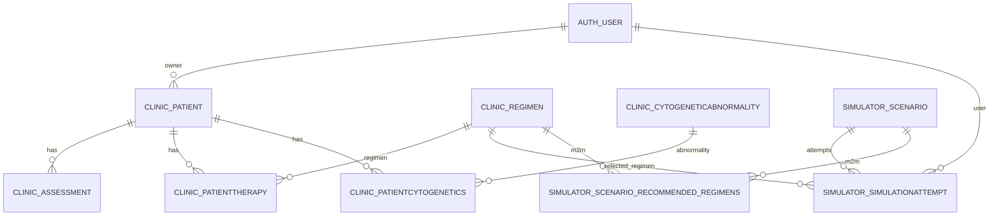

# Database Objects (Model ↔ Table ↔ File)

Questa pagina è pensata per “orientarsi” velocemente: dato un nome (es. `PatientTherapy`) vuoi sapere:

- dove sta nel codice
- come si chiama la tabella nel DB
- quali FK/relazioni usa
- come interrogarlo (ORM e SQL)

!!! info "Fonte"
    - Definizioni dei model: file `*/models*.py`
    - Tabelle effettive: `db.sqlite3` (vedi anche `Guides → Database`)

## Mappa rapida (app → oggetti)

### `clinic`

| Django Model | File | Tabella | Relazioni chiave |
| --- | --- | --- | --- |
| `Patient` | `clinic/models.py` | `clinic_patient` | `owner -> auth_user` |
| `Assessment` | `clinic/models.py` | `clinic_assessment` | `patient -> clinic_patient` |
| `Regimen` | `clinic/models.py` | `clinic_regimen` | usato da Clinic + Simulator |
| `PatientTherapy` | `clinic/models.py` | `clinic_patienttherapy` | `patient -> clinic_patient`, `regimen -> clinic_regimen` |
| `CytogeneticAbnormality` | `clinic/models.py` | `clinic_cytogeneticabnormality` |  |
| `PatientCytogenetics` | `clinic/models.py` | `clinic_patientcytogenetics` | `patient -> clinic_patient`, `abnormality -> clinic_cytogeneticabnormality` |

### `simulator`

| Django Model | File | Tabella | Relazioni chiave |
| --- | --- | --- | --- |
| `Scenario` | `simulator/models.py` | `simulator_scenario` | M2M con `clinic_regimen` |
| `SimulationAttempt` | `simulator/models.py` | `simulator_simulationattempt` | `scenario -> simulator_scenario`, `selected_regimen -> clinic_regimen`, `user -> auth_user` |
| `HelpArticle` | `simulator/models_help.py` | `simulator_helparticle` |  |
| `Scenario.recommended_regimens` (M2M) | `simulator/models.py` | `simulator_scenario_recommended_regimens` | join `scenario_id`, `regimen_id` |

### `chemtools`

| Django Model | File | Tabella | Relazioni chiave |
| --- | --- | --- | --- |
| `ChemJob` | `chemtools/models.py` | `chemtools_chemjob` | `user -> auth_user` |

### `docs_viewer`

| Django Model | File | Tabella | Relazioni chiave |
| --- | --- | --- | --- |
| `DocumentView` | `docs_viewer/models.py` | `docs_viewer_documentview` | `user -> auth_user` |
| `DocumentFeedback` | `docs_viewer/models.py` | `docs_viewer_documentfeedback` | unique (`path`, `user`) |

## Relazioni DB (mini-ER, cliccabile mentalmente)



## Esempi pratici (ORM)

### Caricare un paziente con assessment e terapie

```python
from clinic.models import Patient

patient = Patient.objects.get(mrn="MRN001")
assessments = patient.assessments.all()
therapies = patient.therapies.select_related("regimen").all()
```

### Caricare un attempt e i risultati (JSON)

```python
from simulator.models import SimulationAttempt

attempt = SimulationAttempt.objects.select_related("scenario").get(pk=1)
params = attempt.parameters
results = attempt.results
summary = attempt.results_summary
```

## Esempi pratici (SQL / SQLite)

Mostrare le tabelle “app”:

```sql
SELECT name
FROM sqlite_master
WHERE type='table' AND name NOT LIKE 'sqlite_%'
ORDER BY name;
```

Vedere struttura di una tabella:

```sql
.schema clinic_patienttherapy
```

## “Non trovo un oggetto”: regole di naming

Per default Django usa:

- tabella: `<app>_<model_lower>`
- FK: `<field>_id`
- M2M: `<app>_<model>_<field>` (o simile, a seconda dei nomi)

Se hai dubbi, vai su `Guides → Database` dove trovi anche il DDL completo della SQLite inclusa nel repo.

