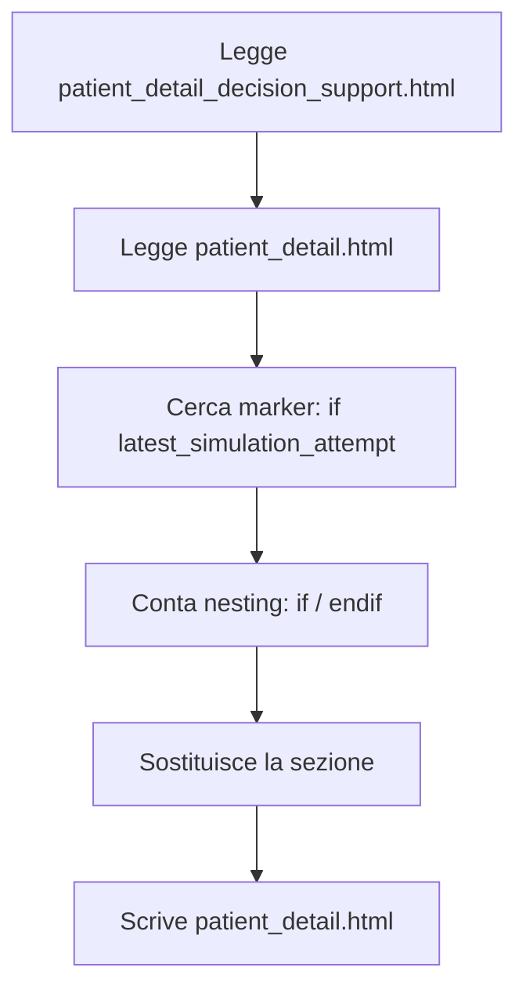

# Scripts (utility)

## `update_template.py`

Scopo: sostituire la sezione “simulation attempt” dentro `clinic/templates/clinic/patient_detail.html` usando il contenuto di `clinic/templates/clinic/patient_detail_decision_support.html`.

Workflow (alto livello):



Esecuzione:

```bash
python3 update_template.py
```

!!! warning "Nota"
    Lo script stampa “Backup saved at … .backup” ma **non crea** effettivamente un backup. Se vuoi, posso correggerlo aggiungendo copia preventiva del file.
